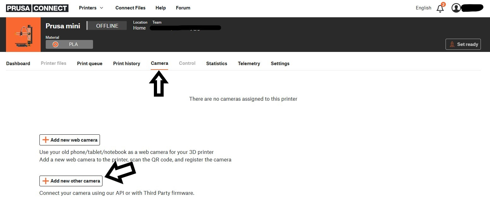
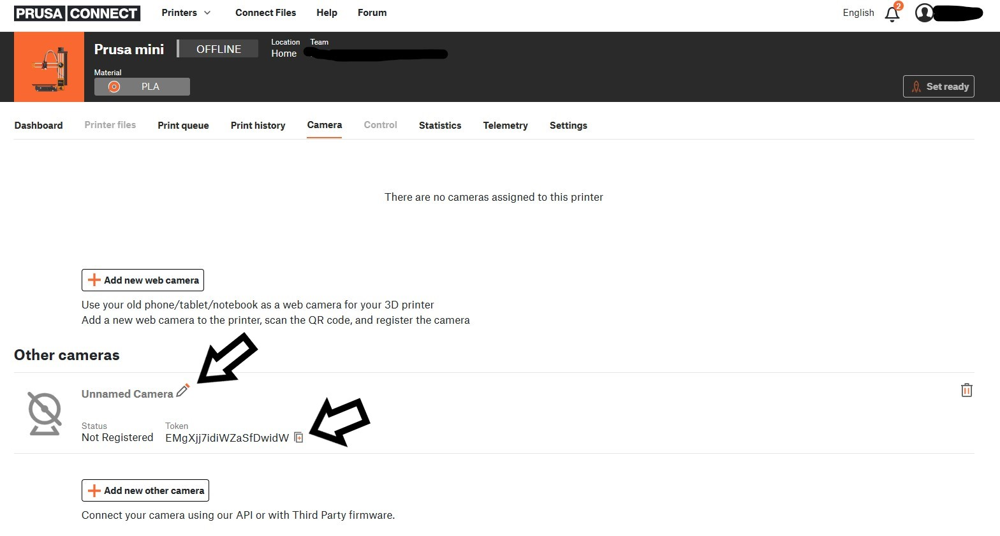
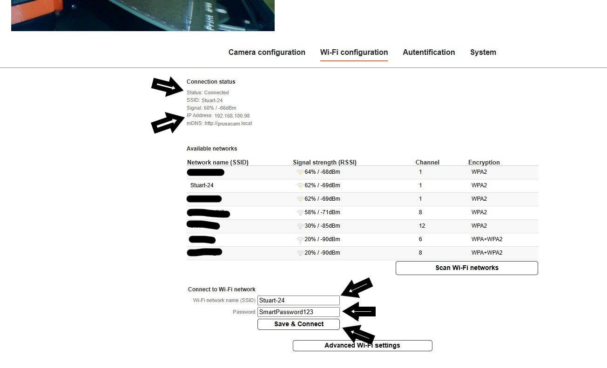
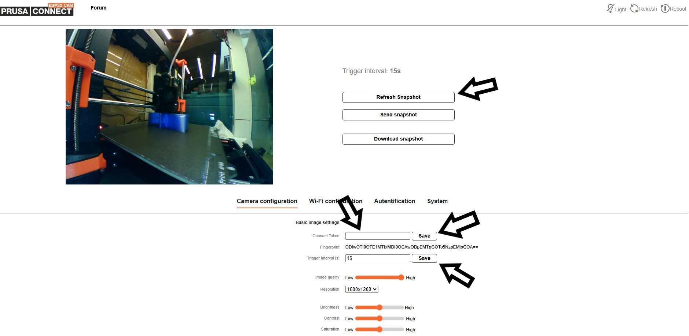
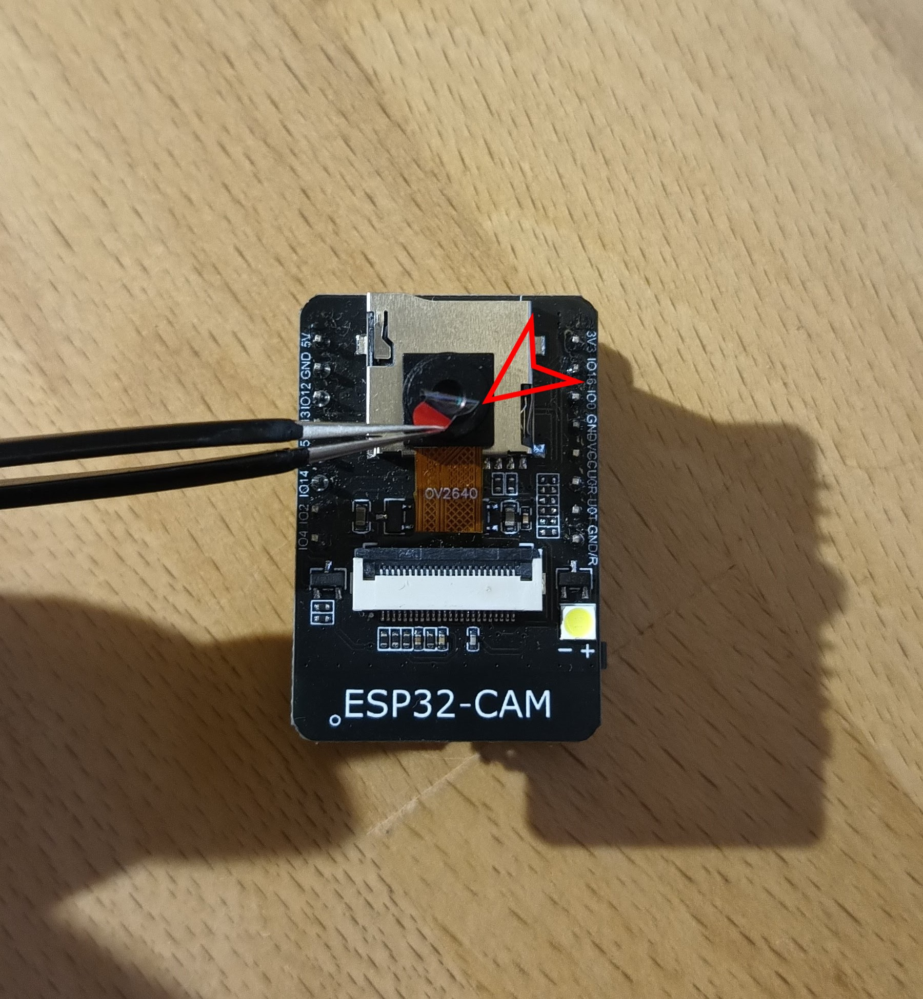
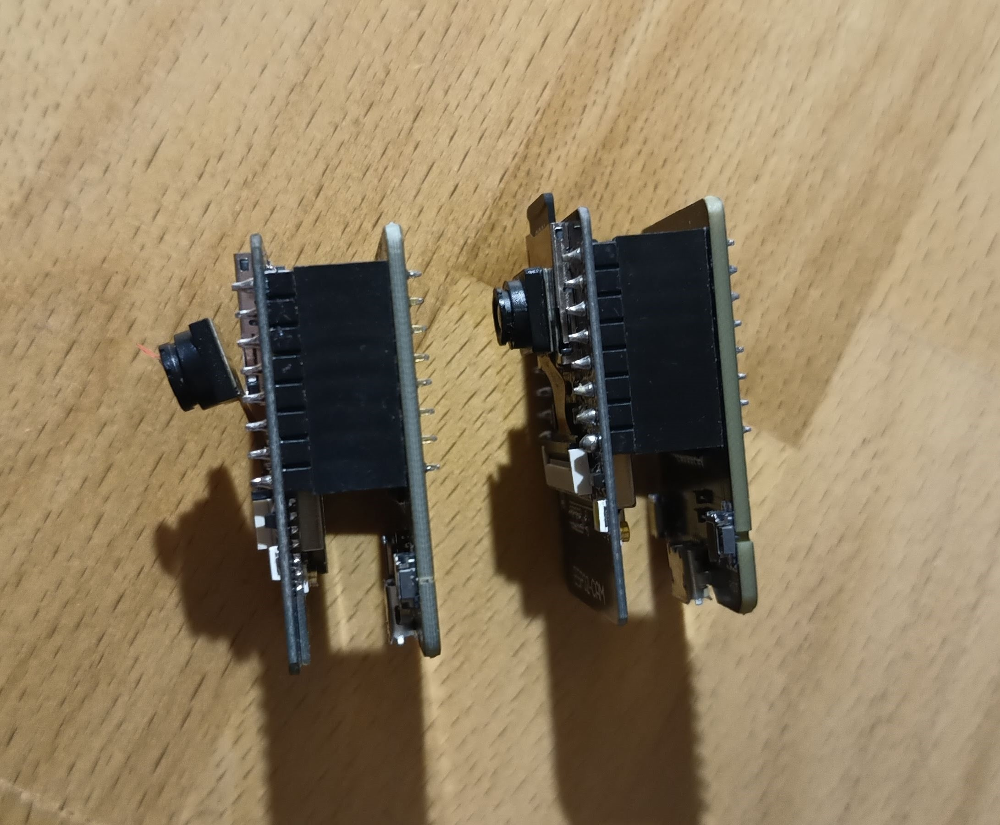
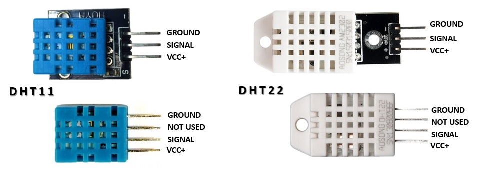
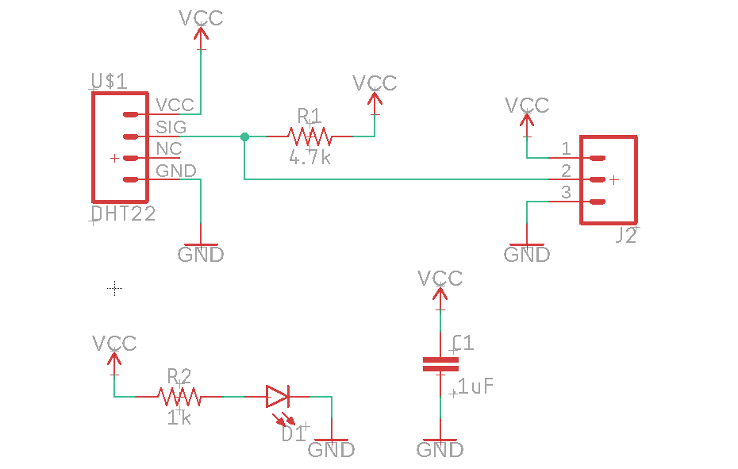

# PrusaConnect ESP32-CAM

This repository includes source code and firmware releases for the **ESP32-cam** module programmed in the **Arduino IDE**. Currently, several versions of boards built on **ESP32/ESP32S3** processors with a camera chip are supported. Below is the list supported boards. Additionally, for each supported board, there is a guide on how to upload the firmware, how to compile code for it, and a basic data informations/issues for the board.

This project uses other libraries. It is necessary to install them in the Arduino IDE.
- App [Arduino IDE 2.3.2](https://www.arduino.cc/en/software)
- MCU support [arduino-ESP32 3.0.2](https://github.com/espressif/arduino-esp32)
- ~~Library [ESPAsyncWebSrv 1.2.7](https://github.com/dvarrel/ESPAsyncWebSrv)~~ To version **1.0.3-rc1**
- ~~Library [AsyncTCP 1.1.4](https://github.com/dvarrel/AsyncTCP)~~ To version **1.0.3-rc1**
- Library [AsyncTCP 3.1.4](https://github.com/mathieucarbou/AsyncTCP)
- Library [ESPAsyncWebServer 3.0.6](https://github.com/mathieucarbou/ESPAsyncWebServer) 
- Library [ArduinoJson 7.1.0](https://github.com/bblanchon/ArduinoJson)
- Library [UniqueID 1.3.0](https://github.com/ricaun/ArduinoUniqueID)
- Library [DHTnew 0.4.20](https://github.com/RobTillaart/DHTNew)

What we need for functionality
- Supported versions of boards built on **ESP32/ESP32-S3** processors with a camera [here](#supported_boards)
- How to flash binary files to ESP32-cam board from Linux/MAC/Windows [ here ](#flash_fw)
- How to compile software in the Arduino IDE [here](#arduino_lib)
- How to connect camera board to Prusa Connect [here](#prusa_connect)
- Service AP [here](#service_ap)
- How to reset the configuration to factory settings [here](#factory_cfg)
- Status LED [ here ](#status_led)
- Debug logs [here](#logs)
- Serial console configuration [here](#serial_cfg)
- WEB API [here](#rest)
- Video stream [here](#stream)
- Manual camera focus [here](#man_focus)
- External temperature sensor DHT22/DHT11 [here](#ext_temp)
- Potential issue [here](#issue)

<a name="supported_boards"></a>
## Supported boards

| Board name                | Support     | Stream | Micro SD | FLASH LED | FW update | DHT22/DHT11 | Documentation                                |
|---------------------------|-------------|--------|----------|-----------|-----------|-------------|----------------------------------------------|
| Ai-Thinker ESP32-cam      | Full        | Yes    | Yes      | Board/Ext | Yes       | Yes         | [ here ](doc/AI_Thinker-ESP32-cam/README.md) |
| ESP32-S3-EYE 2.2          | Full        | Yes    | Yes      | External  | Yes       | Yes         | [ here ](doc/ESP32-S3-EYE-22/README.md)      |
| Freenove ESP32-Wrover cam | Full        | Yes    | No       | External  | Yes       | Yes         | [ here ](doc/ESP32-Wrover-dev/README.md)     |
| Freenove ESP32-S3-Wroom   | in Progress |        |          |           |           |             |                                              | 
| ESP32-S3-DEV-CAM          | in Progress |        |          | External  |           |             | [ here ](doc/ESP32-S3-DEV-CAM/README.md)     |
| Seeed Studio XIAO ESP32S3 | Full        | Yes    | Yes      | External  | Yes       | Yes         | [ here ](doc/XIAO_ESP32S3/README.md)         |
| ESP32-S3-CAM              | Full        | Yes    | Yes      | Board/Ext | Yes       | Yes         | [ here ](doc/ESP32-S3-CAM/README.md)         |

The compiled firmware for each supported board is published with every release.

<a name="flash_fw"></a>
## How to flash binary files to ESP32-cam board from Linux/MAC/Windows

Uploading a precompiled version of the firmware to the MCU is possible from either Linux or Windows OS. Since different boards use various processors and modules, it is not possible to create a single universal guide. Therefore, it is necessary to select the board you are using and then refer to the documentation on how to upload the firmware to it. Here is list with currently [supported boards](#supported_boards).

<a name="arduino_lib"></a>
## How to compile software in the Arduino IDE

The software can be compiled and uploaded to the MCU. Software compilation was done in Arduino IDE. To ensure proper functionality, it is necessary to install support for ESP32 boards into Arduino IDE, as well as several other libraries

At the first step we need to install support for **ESP32 board**.

**File** -> **Preferences** -> **Additional boards managers URLs**

 ```
 https://raw.githubusercontent.com/espressif/arduino-esp32/gh-pages/package_esp32_index.json
 ```

then go to **Tools** -> **Board** -> **Boards Manager...** and install module **ESP32** by **Espressif Systems**

The next step is to install the necessary libraries. Go to **Sketch** -> **Include Library** -> **Manage Libraries...** or you can use **Ctrl+Shift+I**. Then you can search for the necessary libraries and install them. 

For the installation of the **ESPAsyncWebServer** and **AsyncTCP** libraries, it is necessary to download the **ZIP** archive from the official **GIT** repository, and then import it using **Sketch** -> **Include Library** -> **Add .ZIP Library ...**

Then it is possible build and upload the firmware to the board. Each board requires a different Arduino IDE configuration. Therefore, it is necessary to select the board from the [supported boards](#supported_boards) and read the documentation on how to build and upload the firmware.

**For each specific the board type, it's neccerasy** in the file **mcu_cfg.h**, after **line 16** is definitions specify the version of the board for which the software will be compiled. It is necessary to enable the version of the board that will be used.

```c
#define AI_THINKER_ESP32_CAM           false
#define ESP32_WROVER_DEV               true
#define CAMERA_MODEL_ESP32_S3_DEV_CAM  false
#define CAMERA_MODEL_ESP32_S3_EYE_2_2  false
#define CAMERA_MODEL_XIAO_ESP32_S3_CAM false
#define CAMERA_MODEL_ESP32_S3_CAM      false
```

<a name="prusa_connect"></a>
## How to connect camera board to Prusa Connect

- Open up the **Prusa Connect** webpage [connect.prusa3D.com](https://connect.prusa3D.com)
- Log in
- Select a printer you wish to use the camera for.
- Navigate to the **Camera** tab.
- Click **Add new other camera**
- **A new camera will appear** in the list. Here, you can give the camera a name.
- This is the most important part: Copy the **TOKEN** for the given camera and save it for later use.




- Connect the Cam to the **USB Power supply**
- After a brief moment, the camera will start in a **Wi-Fi AP mode**. Essentially, it starts it's own Wi-Fi network. The network name (SSID) is **ESP32_camera_UID**, where **UID** is the first three numbers from the **MCU ID**.
- Find the camera in the Wi-Fi list on your computer.
- Enter the default password: **12345678** and connect to it. After establishing a successful connection, your computer might complain about having "No Internet" on the given network. That is OK.
- Open up a new web browser.
- Open up the **192.168.0.1** IP Address as a webpage. Alternatively, you can also use the http://prusa-esp32cam.local hostname (mDNS) instead of the IP Address.
- The camera's configuration interface should appear.
- In the **Wi-Fi configuration tab** It's necessary to set the SSID of the WiFi network and the password of the WiFi network to which the camera should connect in order to be able to upload images to Prusa Connect. And click to **Save & Connect** button



- In the **Camera configuration tab**, insert the **Token** into the marked field. Click **Save**. **This is the Prusa Connect camera token we have obtained in an earlier step.** Wait until the token has been save successfully.



- Since we're in the camera configuration tab already, we can set up the image options:
- Set up the **resolution**. This will improve the image quality significantly, as the resolution is set to the lowest possible by default.
- Set up the **Trigger interval** and click **Save**.
- Clicking **Refresh snapshot** will refresh the image you see on the page.
- We should now have completed setting up the camera.

While we are on the ESP camera's configuration page, let's take a quick look at the other options it offers.
- Camera configuration tab contain
  - Camera cip settings
  - Authentication token setting
  - Camera flash settings
- Wi-Fi configuration tab contain 
  - Setting the wifi network to which the camera can connect
  - The possibility of turning off the service AP
  - Option to set static IP addresses for WiFi networks to which the camera connects
- On the **Authentication** tab, you can set a password to access the configuration page. Default login is admin:admin.
- The **System tab** provides several advanced options such as:
  - Setting a Hostname (mDNS record) for easier future access to the configuration page over the local network.
  - For a manual firmware update, select the firmware file **ESP32_PrusaConnectCam.ino.bin** and click **Upload file & Update**. Afterwards, reboot the camera.
  - Update from cloud. To check for firmware updates, select **Check Update from cloud**. If a newer version is available, click **Update from cloud**. Note that the camera has to be connected to the Internet, before using these functions.
  - Setting **log level** and getting logs from the camera. To get the logs, it is necessary to have a micro SD card formatted to **FAT32** inserted in the camera!
  - Check the status of uploading the image to Prusa Connect using the **PrusaConnect Status:** variable

**Interesting improvements.** There is a protective film on the camera module. The protective film needs to be removed from the lens.



The second problem is that the camera module is not usually attached to the micro SD card slot. Therefore, the camera module overheats. This can permanently damage the camera module. If the quality of the camera module decreases, the resulting image starts to have a purple tint. Therefore, it is necessary to attach the camera module to the micro SD card socket with double-sided tape. Ideally, with double-sided thermal tape.



<a name="service_ap"></a>
## Service AP

After powering on and booting up the camera, it enters **AP mode**, which serves as a configuration mode for the camera. Essentially, it starts its own Wi-Fi network. The network name (SSID) is **ESP32_camera_UID**, where **UID** is the first three numbers from the **MCU ID**, serving as a unique identifier for the camera. The password for connecting to the AP is **12345678**. The camera's IP address is **192.168.0.1**. To configure the camera via **AP mode**, you need to connect to this IP address using a web browser: **http://192.168.0.1**. Alternatively, you can also use the **http://prusa-esp32cam.local** hostname (**mDNS**) instead of the IP Address.

After establishing a successful connection, your computer might display a "**No Internet**" warning for the given network. **This is normal**.

If you have set up a Wi-Fi network name (SSID) and password in the camera for it to connect to, then upon powering on, the camera will automatically connect to the configured Wi-Fi network and simultaneously activate AP mode for **5 minutes**. AP mode is always enabled after powering on and booting up the camera for **5 minutes**. The service Wi-Fi AP is **automatically deactivates** itself after **5 minutes** following each camera startup if no device is connected to the camera.

Service AP is for for the first camera configuration. If the camera is connected to a WiFi network, it is possible to configure it from the local network.

<a name="factory_cfg"></a>
## How to reset configuration to factory settings
Each version of the [supported board](#supported_boards) uses a different pin for camera reset. Therefore, it is necessary to refer to the documentation for the specific board to determine which pin is used for reset camera configuration to factory configuration.

The procedure is always the same:
- Ground the pin for camera reset configuration.
- Connect the power supply.
- Wait for 10 seconds.
- An LED will start blinking (refer to the board's documentation).
- Disconnect the ground from the camera reset configuration pin.
- The LED will stop blinking.
- The camera configuration will be restored to factory settings.

<a name="status_led"></a>
## Status LED

On the board, there is a status LED that provides a visual indicator of the module's current status
through blinking at defined intervals. Each [supported board](#supported_boards) has the STATUS LED located in a different place. It is necessary to refer to the documentation to locate the STATUS LED on the board.

Upon module activation, the LED illuminates. After processor initialization, the LED exhibits different blinking intervals based on the current mode of the module

- **Service AP Mode only:** The LED blinks every **400 ms**, indicating the module's availability in service AP mode.
- **Connecting to WiFi AP:** While connecting to a WiFi Access Point, the LED blinks at intervals of **800 ms**.
- **Connected to WiFi Network:** Upon successful connection to a WiFi network, the LED blinks at intervals of **4000 ms**, signaling a stable connection.
- **Problematic State:** If an issue or error occurs, the LED accelerates its blinking to every **100 ms**.

The approximate boot time of the device is 15-20 seconds.

<a name="logs"></a>
## Debug logs

It is possible to save debug logs to a microSD card, but the card must be formatted to FAT32. Currently, the maximum tested capacity for a microSD card is 16GB. If a microSD card is inserted into the camera, it is necessary to reboot the camera. When a microSD card is inserted into the camera before boot, logging to the microSD card is automatically enabled. If no microSD card is inserted, the saving of debug logs to the microSD card is automatically disabled. Enabling the saving of debug logs to a microSD card is only possible during camera boot, so it is necessary to restart the camera after inserting the microSD card. Debug logs are saved as plain text in the file Syslog.log

<a name="serial_cfg"></a>
## Serial console configuration

Currently, it is possible to set the basic camera configuration using the serial console. Baud speed for communication with MCU is **115200 8N1**

Commands for configuration have simple syntax

|   command    | separator | variable  | termination | line terminator          |
|--------------|-----------|-----------|-------------|--------------------------|
| setwifissid  |     :     |   SSID    |     ;       | \n or \r or \n\r or \r\n | 

Currently, available commands are listed in the table below:

| Command           | Description                                                         |
|-------------------|---------------------------------------------------------------------|
| setwifissid       | Setting WiFi SSID, where variable SSID is network name              |
| setwifipass       | Setting WiFi password, where variable PASSWORD is WiFi password     |
| wificonnect       | Connecting to WiFi network                                          |
| mcureboot         | Rebooting the MCU                                                   |
| commandslist      | Listing currently supported commands via serial console             |
| getwifimode       | Print current WiFi mode. STA/AP/AP+STA                              |
| getwifistastatus  | Print WiFi STA status. Connected/Disconnected/Connecting....        |
| getwifistaip      | Print IP address for WiFi STA                                       |
| getserviceapssid  | Print service AP SSID name                                          |
| setauthtoken      | Set authentication token for Prusa Connect                          |
| otaupdate         | Start OTA update process                                            |
| resolution        | Set photo resolution                                                |
| photoquality      | Set photo quality                                                   |
| setflash          | enable/disable LED flash                                            |
| setlight          | enable/disable LED light                                            |
| loglevel          | set log level. 0=Error, 1=Warning, 2=Info, 3=Verbose                |

The standard command sequence for camera basic settings is

- setwifissid:SSID;
- setwifipass:PASSWORD;
- wificonnect;
- setauthtoken:TOKEN;
- mcureboot;

<a name="rest"></a>
## WEB API

The camera have a WEB API, allowing several operations to be performed through the web interface.

| Command                   | Description                                      |
|---------------------------|--------------------------------------------------|
| http://IP/action_capture  | Capture snapshot                                 |
| http://IP/action_send     | Capture snapshot, and send to Prusa Connect      |
| http://IP/light?on        | Light ON                                         |
| http://IP/light?off       | Light OFF                                        |
| http://IP/flash?on        | FLASH ON                                         |
| http://IP/flash?off       | FLASH OFF                                        |
| http://IP/action_reboot   | Reboot MCU                                       |
| http://IP/get_logs        | Get logs from micro SD card                      |
| http://IP/saved-photo.jpg | Get last captured photo                          |
| http://IP/get_temp        | Get temperature from external sensor             |
| http://IP/get_hum         | Get humidity from external sensor                |

<a name="stream"></a>
## Video stream 

The video stream is available on the WEB page **http://IP/stream.mjpg**

<a name="man_focus"></a>
## Manual camera focus

Usually, the camera module is properly focused. However, the camera module can be manually focused. There are several types of lenses for camera modules. I have created several [Tools](https://www.printables.com/cs/model/877739-esp32-cam-ov2640-focus-adjustment-wrench)  for manually focusing the camera module.


First, it is necessary to hold the camera with a holder and then put the wrench on the lens. Next, gently turn the wrench by a couple of degrees, and observe the difference.

**WARNING! Manual focusing can permanently damage the camera module!**

<a name="ext_temp"></a>
## External temperature sensor 

The software supports an external temperature sensor **DHT22** or **DHT11**. The sensor needs to be connected according to the manual for the specific version of the board. The temperature and humidity are automatically read every 30 seconds after the enable sensor.



Information about sensor

|                   | DHT11        | DHT22            |
|-------------------|--------------|------------------|
| Operating voltage | 3-5V         | 3-5V             |
| Max current       | 2.5 mA       | 2.5mA            |
| Temperature range | 0-50°C ± 2°C | -40-80°C ± 0.5°C |
| Humidity range    | 20-80% / 5%  | 0-100% / 2-5%    |
| Sampling rate     | 1Hz          | 0.5Hz            |

It is necessary to use the **module**, **not the sensor**! The module with the sensor has a **4.7Kohm** resistor soldered onto the PCB, which is necessary for the proper functioning of the **one-wire bus**. If you use the sensor, it is necessary to connect a 4.7K ohm resistor to the one-wire bus as shown in the schematic below. **The module must be powered with 3.3V VCC, otherwise, it may damage the camera board.**

Here is a typical schematic for the DHT22 or DHT11 sensor:



<a name="issue"></a>
## Troubleshooting

- A potential issue may arise with connecting to the service AP. If the connection fails and an authentication error occurs, it is necessary to clear the FLASH memory of the processor, and FLASH FW again. This can be done either through the Arduino IDE or using official software.
- After the initial firmware upload to the new camera, there may be an issue when connecting to the IP address, where the camera prompts for a username and password to access the web page. Even when entering the username "admin" and the password "admin", the login still doesn't work. In such cases, it's necessary to reset the camera configuration to factory settings. The procedure is outlined in the readme file [here](#factory_cfg)
- If you are getting a 400 return code from Prusa Connect, then you need to create a new other camera in Prusa Connect and enter a new token into the ESP32 camera.
- If you are getting a 404 return code from Prusa Connect, it may indicate that the printer is powered off. The printer must be powered on in order for images to be uploaded.
