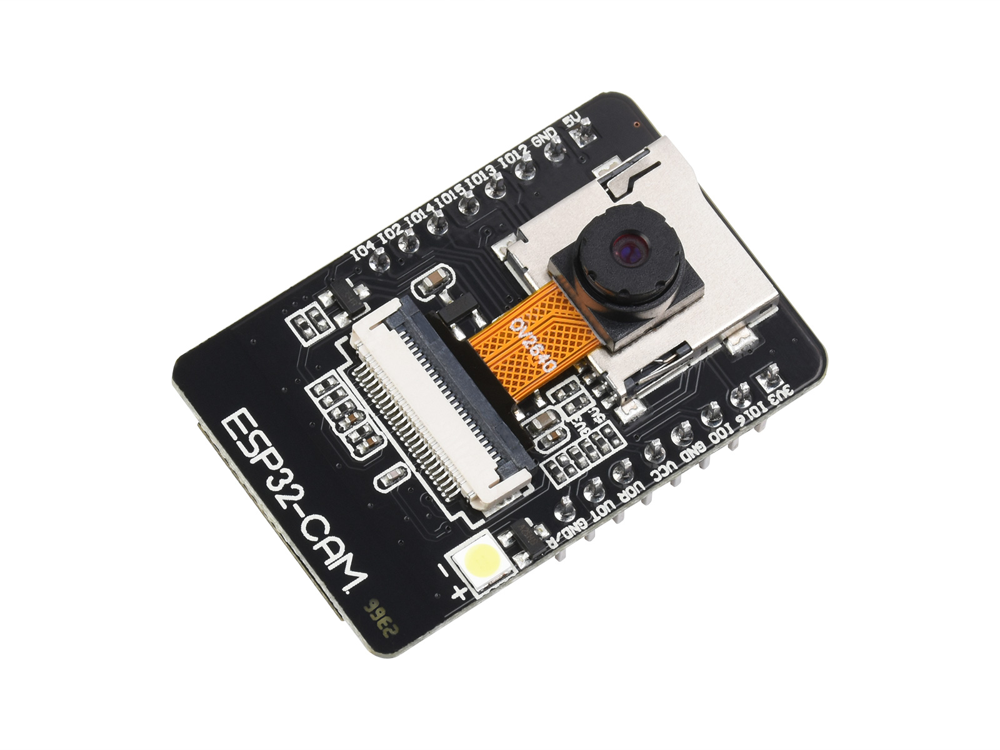
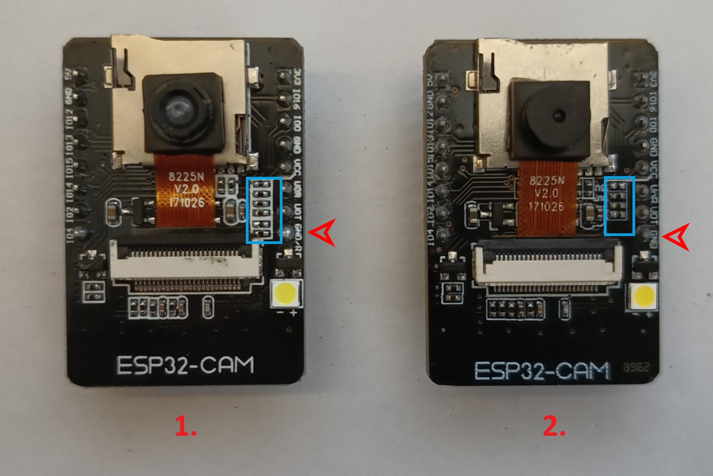
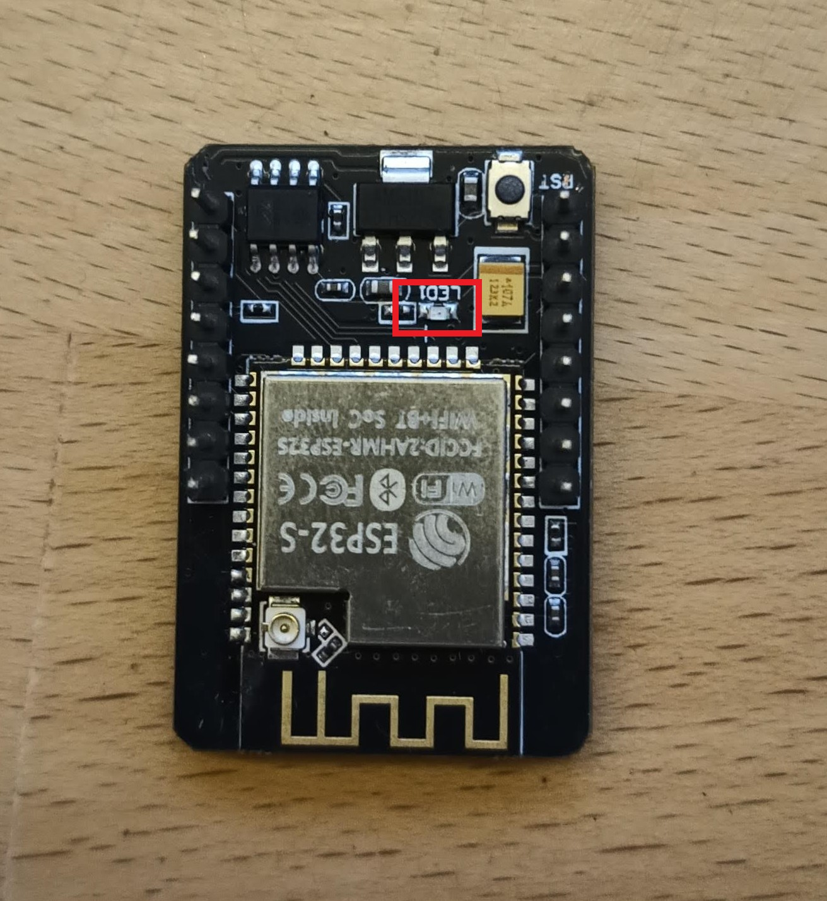
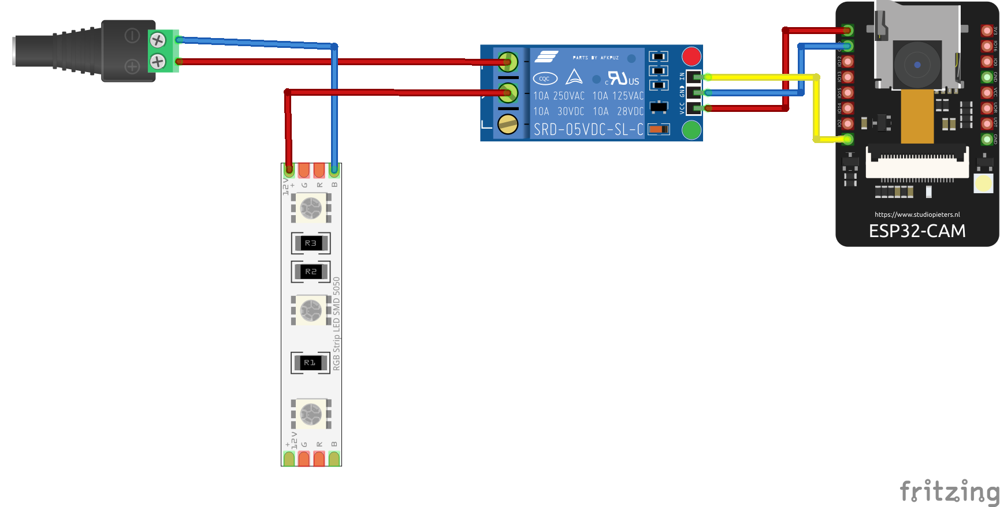
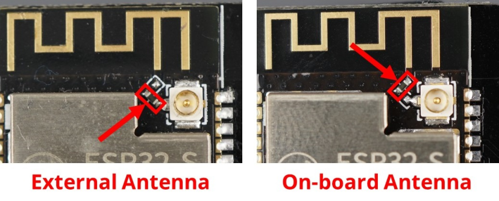

# PrusaConnect ESP32-CAM

This repository includes source code and firmware releases for the ESP32-cam module programmed in the Arduino IDE

This project uses other libraries. It is necessary to install them in the Arduino IDE.
- App [Arduino IDE 2.3.2](https://www.arduino.cc/en/software)
- MCU support [ESP32 2.0.16](https://github.com/espressif/arduino-esp32)
- Library [ESPAsyncWebSrv 1.2.7](https://github.com/dvarrel/ESPAsyncWebSrv)
- Library [AsyncTCP 1.1.4](https://github.com/dvarrel/AsyncTCP)
- Library [ArduinoJson 7.0.4](https://github.com/bblanchon/ArduinoJson)
- Library [UniqueID 1.3.0](https://github.com/ricaun/ArduinoUniqueID)

What we need for functionality
- ESP32-CAM AI-thinker board with OV2640 camera module [ here ](#esp32)
- Module board version [here](#different_mcu)
- Install the necessary libraries in the Arduino IDE [ here ](#arduino_lib)
- Arduino IDE configuration [ here ](#arduino_cfg)
- How to flash binary files to ESP32-cam board from Linux/MAC/Windows [ here ](#flash_fw)
- How to connect ESP32-cam to Prusa Connect [here](#prusa_connect)
- Service AP [here](#service_ap)
- How to reset the configuration to factory settings [here](#factory_cfg)
- Status LED [ here ](#status_led)
- Schematic main board is [here](#schematic)
- Issue with FLASH LED on the main board [here](#led_issue)
- External WiFi antenna [here](#ext_wifi)
- Power supply [here](#power_supply)
- Debug logs [here](#logs)
- Serial console configuration [here](#serial_cfg)
- Video stream [here](#stream)
- Potential issue [here](#issue)

<a name="esp32"></a>
## ESP32-CAM AI-thinker board 
It's a few dollars board with **ESP32** MCU and Camera. It's necessary to buy a board with **camera module OV2640**. The board is sold without a programmer by default. It is possible to program it using the FTDI USB to UART converter, or purchase an official programmer for the board. We recommend purchasing an official programmer. It can save a lot of trouble with connecting and programming the board. There are currently [2 different board versions](#different_mcu), but only one is compatible with the official programmer.



In the following picture, we can see the **ESP32-CAM** board and the programator for the board. 


It's necessary to use a camera version **OV2640**. If using a different camera, modification of the camera's pinout can be needed, or some camera settings may not work correctly. We recommend to use a camera module with a viewing angle of 120° or 160°.

These are currently known or tested camera modules:

| Camera chip | FOV  | Resolution | Tested | Works | Description                              |
|-------------|------|------------|--------|-------|------------------------------------------|
| OV2640      | 30°  |    2MP     |   No   |  N/A  |                                          |
| OV2640      | 44°  |    2MP     |   No   |  N/A  |                                          |
| OV2640      | 66°  |    2MP     |   Yes  |  Yes  | Recommended. Standard camera module      |
| OV2640      | 120° |    2MP     |   Yes  |  Yes  | Recommended                              |
| OV2640      | 160° |    2MP     |   Yes  |  Yes  | Recommended                              |
| OV2640      | 200° |    2MP     |   No   |  N/A  |                                          |
| OV2640      | 222° |    2MP     |   No   |  N/A  |                                          |
| OV2640IR    | 160° |    2MP     |   Yes  |  Yes  |                                          |
| OV8225N     | 66°  |    2MP     |   Yes  |  Yes  |                                          |
| OV3360      | 66°  |    3MP     |   Yes  |  Yes  |                                          |
| OV5640-AF   | 72°  |    5MP     |   Yes  |  Yes  | Overheating, slow photo loading          |

<a name="different_mcu"></a>
## Different MCU version

There are currently 2 versions of the board, but only one version is possible programming via oficial **CH340** programmer. The blue rectangle shows the differences between the HW versions.



The red arrow points to a pin that differs between these boards. In version 1, this pin is used for **MCU RESET (GND/R)**. In version 2, this pin serves as ground **(GND)**. Version 1 can be programmed via **CH340**, whereas version 2 cannot be programmed via **CH340**. For version 2, we tested programming via **FT232RL** or **CP2102**, and the programming process worked successfully.

If we want to program the MCU without the original programmer with **CH340**, or if we want to program the second version of the board, then we need to follow the following instructions. We will need a USB to UART converter, such as **FT232**, **CP2102** or **CH340**. I have tested firmware uploading to the **ESP32-cam** with these converters. Uploading FW to the **second** version using **CH340** did not work for me. Uploading FW using **CH340** only worked for me for the first version of **ESP32-cam** board. For the next steps, I will use the **FT232RL** converter. We connect the **ESP32-cam** to the **FT232** according to the following diagram, where we connect:


- **VCC** from **FT232** to **5V** on the **ESP32-CAM**. **CAUTION!** It is necessary to observe the maximum supply voltage of the **ESP32-CAM**, otherwise irreversible damage to the **ESP32-CAM** module may occur.
- **GND** from **FT232** to **GND** on the **ESP32-CAM**
- **TX** from **FT232** to **U0R** on the **ESP32-CAM**
- **RX** from **FT232** to **U0T** on the **ESP32-CAM**
- **IO0** from **ESP32-CAM** to **GND** on **ESP32-CAM**. By connecting the **IO0** pin to **GND**, we switch the board to the mode in which it expects firmware uploading.

Next step is connect the **FT232** converter to the PC and install the correct driver. Then we proceed with uploading the firmware to the **ESP32-cam**, which is described [here](https://github.com/prusa3d/Prusa-Firmware-ESP32-Cam?tab=readme-ov-file#how-to-flash-binary-files-to-esp32-cam-board-from-linuxmacwindows). After successfully uploading the firmware to the **ESP32-cam**, we disconnect **IO0** from **GND**, disconnect the **FT232** converter from the **ESP32-CAM**, and connect the **ESP32-CAM** to the power supply.

The recommended version includes the MCU ESP32 (ESP32-S) with 520 KB of SRAM and external 4M PSRAM

<a name="arduino_lib"></a>
## Necessary libraries in the Arduino IDE

Software compilation was done in Arduino IDE 2.3.2. To ensure proper functionality, it is necessary to install support for ESP32 boards into Arduino IDE, as well as several other libraries

At the first step we need to install support for **ESP32 board**.

**File** -> **Preferences** -> **Additional boards managers URLs**

 ```
 https://raw.githubusercontent.com/espressif/arduino-esp32/gh-pages/package_esp32_index.json
 ```

then go to **Tools** -> **Board** -> **Boards Manager...** and install module **ESP32** by **Espressif Systems**, version **2.0.15**

The next step is to install the necessary libraries. Go to **Sketch** -> **Include Library** -> **Manage Libraries...** or you can use **Ctrl+Shift+I**. Then you can search for the necessary libraries and install them.

- Library [ESPAsyncWebSrv by dvarrel 1.2.7](https://github.com/dvarrel/ESPAsyncWebSrv)
- Library [AsyncTCP by dvarrel 1.1.4](https://github.com/dvarrel/AsyncTCP)
- Library [ArduinoJson by bblanchon 7.0.4](https://github.com/bblanchon/ArduinoJson)
- Library [UniqueID by Luiz Henrique Cassettari1.3.0](https://github.com/ricaun/ArduinoUniqueID)

<a name="arduino_cfg"></a>
## Arduino IDE configuration

Board configuration in the Arduino IDE 2.3.2
- Tools -> Board -> ESP32 Arduino -> AI Thinker ESP32
- Tools -> Flash frequency -> 80MHz
- Tools -> Core Debug Level -> None
- Tools -> Erase all Flash Before Sketch Upload -> Disable **(first flash, new board = enable. otherwise = disable)**
- Tools -> Flash Mode -> DIO
- Tools -> Partition scheme -> Minimal SPIFFS (1.9MB APP with OTA/190KB SPIFFS)

When flashing the firmware to a new, empty ESP32-CAM device for the first time, it is necessary to use the 'Erase' function. 

This can be found under **Tools** -> **Erase all Flash Before Sketch Upload** -> **Enable**. 

After the initial firmware upload to the MCU, it's necessary to disable this option. If you do not disable this option, your camera configuration will continue to be erased from the flash memory after uploading new firmware from the Arduino IDE.

<a name="flash_fw"></a>
## How to flash binary files to ESP32-cam board from Linux/MAC/Windows

#### Linux/MAC

You must use the console to upload the firmware on the MAC or Linux platform. First, ensure you have installed esptool for Python. You can find it on the manufacturer's website, ESPRESSIF, [here](https://docs.espressif.com/projects/esp-at/en/latest/esp32/Get_Started/Downloading_guide.html#linux-or-macos).

And command for FLASH FW is here, where **/dev/ttya0** is your serial interface for communication with the ESP32-cam board. This is the command for the first flash FW to MCU.

```
./esptool -p /dev/ttya0 -b 460800 --before default_reset --after hard_reset --chip esp32 write_flash --erase-all --flash_mode dio --flash_size 4MB --flash_freq 80m 0x1000 ESP32_PrusaConnectCam.ino.bootloader.bin 0x8000 ESP32_PrusaConnectCam.ino.partitions.bin 0x10000 ESP32_PrusaConnectCam.ino.bin
```

This command contains the parameter **--eras-all**, which erases the entire flash in the MCU. So, for just updating the firmware, it is necessary to remove the parameter **--eras-all**; otherwise, the MCU configuration will also be deleted. The basic command list can be found [here](https://docs.espressif.com/projects/esptool/en/latest/esp32s3/esptool/basic-commands.html)

Here is the command for updating the firmware in the MCU without erasing the MCU configuration

```
./esptool -p /dev/ttya0 -b 460800 --before default_reset --after hard_reset --chip esp32 write_flash --flash_mode dio --flash_size 4MB --flash_freq 80m 0x1000 ESP32_PrusaConnectCam.ino.bootloader.bin 0x8000 ESP32_PrusaConnectCam.ino.partitions.bin 0x10000 ESP32_PrusaConnectCam.ino.bin
```

Launching the esptool application may be different in different operating systems

#### Windows

Here is the tool and configuration for [windows platform](https://www.espressif.com/en/support/download/other-tools) 

You can find the driver for CH340 for Windows for example [here](https://www.wch-ic.com/search?q=CH340&t=downloads) . An older version of the driver is for example [here](https://blog.laskakit.cz/wp-content/uploads/2020/03/CH341SER.zip)


It's necessary to erase the FLASH using the **ERASE** button before the first firmware flash.


#### Partitions table

Here is the partitions table:

| Name    | Type    | SubType | Offset   | Size     | Flags |
|---------|---------|---------|----------|----------|-------|
| nvs     | data    | nvs     | 0x9000   | 0x5000   |       |
| otadata | data    | ota     | 0xe000   | 0x2000   |       |
| app0    | app     | ota_0   | 0x10000  | 0x1E0000 |       |
| app1    | app     | ota_1   | 0x1F0000 | 0x1E0000 |       |
| spiffs  | data    | spiffs  | 0x3D0000 | 0x20000  |       |
| coredump| data    | coredump| 0x3F0000 | 0x10000  |       |

However, for uploading the firmware, it's important to use this configuration of addresses and files:

- address **0x1000** - **ESP32_PrusaConnectCam.ino.bootloader.bin**
- address **0x8000** - **ESP32_PrusaConnectCam.ino.partitions.bin**
- address **0x10000** - **ESP32_PrusaConnectCam.ino.bin**

<a name="prusa_connect"></a>
## How to connect ESP32-cam to Prusa Connect

- Open up the **Prusa Connect** webpage [connect.prusa3D.com](https://connect.prusa3D.com)
- Log in
- Select a printer you wish to use the camera for.
- Navigate to the **Camera** tab.
- Click **Add new other camera**
- **A new camera will appear** in the list. Here, you can give the camera a name.
- This is the most important part: Copy the **TOKEN** for the given camera and save it for later use.


- Connect the Cam to the **USB Power supply**
- After a brief moment, the camera will start in a **Wi-Fi AP mode**. Essentially, it starts it's own Wi-Fi network. The network name (SSID) is **ESP32_camera_UID**, where **UID** is the first three numbers from the **MCU ID**.
- Find the camera in the Wi-Fi list on your computer.
- Enter the default password: **12345678** and connect to it. After establishing a successful connection, your computer might complain about having "No Internet" on the given network. That is OK.
- Open up a new web browser.
- Open up the **192.168.0.1** IP Address as a webpage. Alternatively, you can also use the http://prusa-esp32cam.local hostname (mDNS) instead of the IP Address.
- The camera's configuration interface should appear.
- In the **Wi-Fi configuration tab** It's necessary to set the SSID of the WiFi network and the password of the WiFi network to which the camera should connect in order to be able to upload images to Prusa Connect. And click to **Save & Connect** button


- In the **Camera configuration tab**, insert the **Token** into the marked field. Click **Save**. **This is the Prusa Connect camera token we have obtained in an earlier step.** Wait until the token has been save successfully.


- Since we're in the camera configuration tab already, we can set up the image options:
- Set up the **resolution**. This will improve the image quality significantly, as the resolution is set to the lowest possible by default.
- Set up the **Trigger interval** and click **Save**.
- Clicking **Refresh snapshot** will refresh the image you see on the page.
- We should now have completed setting up the camera.

While we are on the ESP camera's configuration page, let's take a quick look at the other options it offers.
- Camera configuration tab contain
  - Camera cip settings
  - Authentication token setting
  - Camera flash settings
- Wi-Fi configuration tab contain 
  - Setting the wifi network to which the camera can connect
  - The possibility of turning off the service AP
  - Option to set static IP addresses for WiFi networks to which the camera connects
- On the **Authentication** tab, you can set a password to access the configuration page.
- The **System tab** provides several advanced options such as:
  - Setting a Hostname (mDNS record) for easier future access to the configuration page over the local network.
  - For a manual firmware update, select the firmware file **ESP32_PrusaConnectCam.ino.bin** and click **Upload file & Update**. Afterwards, reboot the camera.
  - Update from cloud. To check for firmware updates, select **Check Update from cloud**. If a newer version is available, click **Update from cloud**. Note that the camera has to be connected to the Internet, before using these functions.
  - Setting **log level** and getting logs from the camera. To get the logos, it is necessary to have a micro SD card formatted to **FAT32** inserted in the camera!
  - Check the status of uploading the image to Prusa Connect using the **PrusaConnect Status:** variable
  
<a name="service_ap"></a>
## Service AP

After powering on and booting up the camera, it enters **AP mode**, which serves as a configuration mode for the camera. Essentially, it starts its own Wi-Fi network. The network name (SSID) is **ESP32_camera_UID**, where **UID** is the first three numbers from the **MCU ID**, serving as a unique identifier for the camera. The password for connecting to the AP is **12345678**. The camera's IP address is **192.168.0.1**. To configure the camera via **AP mode**, you need to connect to this IP address using a web browser: **http://192.168.0.1**. Alternatively, you can also use the **http://prusa-esp32cam.local** hostname (**mDNS**) instead of the IP Address.

After establishing a successful connection, your computer might display a "**No Internet**" warning for the given network. **This is normal**.

If you have set up a Wi-Fi network name (SSID) and password in the camera for it to connect to, then upon powering on, the camera will automatically connect to the configured Wi-Fi network and simultaneously activate AP mode for **5 minutes**. AP mode is always enabled after powering on and booting up the camera for **5 minutes**. The service Wi-Fi AP is **automatically deactivates** itself after **5 minutes** following each camera startup if no device is connected to the camera.

Service AP is for for the first camera configuration. If the camera is connected to a WiFi network, it is possible to configure it from the local network.

<a name="factory_cfg"></a>
## How to reset configuration to factory settings
To reset the settings to factory defaults, follow these instructions:


- Connect PIN **IO12** to **ground**.
- **Plug in** the power supply.
- Wait for **10 seconds**.
- After 10 seconds, the **FLASH LED will start flashing**.
- **Disconnect** PIN **IO12** from **ground** (but don't disconnect the power supply).
- After disconnecting **IO12** from **ground**, the **FLASH LED** will **stop flashing**, and the MCU will **automatically reboot**.
- Now the MCU is in the factory settings.

<a name="status_led"></a>
## Status LED

On the board, there is a status LED that provides a visual indicator of the module's current status
through blinking at defined intervals.



Upon module activation, the LED illuminates. After processor initialization, the LED exhibits different blinking intervals based on the current mode of the module

- **Service AP Mode only:** The LED blinks every **400 ms**, indicating the module's availability in service AP mode.
- **Connecting to WiFi AP:** While connecting to a WiFi Access Point, the LED blinks at intervals of **800 ms**.
- **Connected to WiFi Network:** Upon successful connection to a WiFi network, the LED blinks at intervals of **4000 ms**, signaling a stable connection.
- **Problematic State:** If an issue or error occurs, the LED accelerates its blinking to every **100 ms**.

The approximate boot time of the device is 15-20 seconds.

<a name="schematic"></a>
## Schematic for ESP32-cam board


Board description


Pinout


<a name="led_issue"></a>
## FLASH LED issue
The board has a problem with the FLASH LED, as it lacks any current limitation for the LED. Consequently, frequent use of the FLASH LED can lead to malfunction, due to excessive current flow.

One simple solution is to connect an external LED via a relay, transistor, or MOSFET to the board, as shown in the next picture. Using a relay is not ideal, but it provides a simple solution.



Another solution is to use an LED COB or a USB LED lamp. I utilized a board from a simple USB LED lamp. The transistor has a current limitation of 500mA, and my USB lamp has a current consumption of approximately 180mA. The original LED has a current consumption of 60-80mA. After calculation, the total current consumption is approximately 260mA, which falls within the current limitation of the transistor. Therefore, it is possible to solder the negative wire from the COB LED or the USB LED lamp to the transistor. The positive wire needs to be soldered to +5V.

This is my USB LED lamp


The next step is to solder the negative wire from the LED lamp to the transistor collector, and the positive wire from the LED lamp to the +5V on the board.


The third option is to solder a resistor between the collector of the transistor and the PCB. I used a 10-ohm resistor in a 0603 package. This option is more complicated for users with limited soldering experience.


<a name="ext_wifi"></a>
## External/internal WiFi antenna

The standard ESP32-CAM board utilizes an internal antenna on the PCB. However, this antenna can sometimes cause issues with the quality of the WiFi signal, leading to slow photo uploads to PrusaConnect or connectivity problems. Fortunately, there is an option to connect an external antenna. This requires changing the resistor position, as shown in the picture below. Then, you can use a 2.4GHz Wi-Fi cable with a U.FL to RP-SMA connector and a standard 2.4GHz WiFi antenna



<a name="power_supply"></a>
## Power Supply

The device requires a 5V power supply, with a maximum current consumption of 2A. Power is supplied via a micro USB connector when using the original programmer.

<a name="logs"></a>
## Debug logs

It is possible to save debug logs to a microSD card, but the card must be formatted to FAT32. Currently, the maximum tested capacity for a microSD card is 16GB. If a microSD card is inserted into the camera, it is necessary to reboot the camera. When a microSD card is inserted into the camera before boot, logging to the microSD card is automatically enabled. If no microSD card is inserted, the saving of debug logs to the microSD card is automatically disabled. Enabling the saving of debug logs to a microSD card is only possible during camera boot, so it is necessary to restart the camera after inserting the microSD card. Debug logs are saved as plain text in the file Syslog.log

<a name="serial_cfg"></a>
## Serial console configuration

Currently, it is possible to set the basic camera configuration using the serial console. Baud speed for communication with MCU is **115200 8N1**

Commands for configuration have simple syntax

|   command    | separator | variable  | termination | line terminator          |
|--------------|-----------|-----------|-------------|--------------------------|
| setwifissid  |     :     |   SSID    |     ;       | \n or \r or \n\r or \r\n | 

Currently, available commands are listed in the table below:

| Command           | Description                                                         |
|-------------------|---------------------------------------------------------------------|
| setwifissid       | Setting WiFi SSID, where variable SSID is network name              |
| setwifipass       | Setting WiFi password, where variable PASSWORD is WiFi password     |
| wificonnect       | Connecting to WiFi network                                          |
| mcureboot         | Rebooting the MCU                                                   |
| commandslist      | Listing currently supported commands via serial console             |
| getwifimode       | Print current WiFi mode. STA/AP/AP+STA                              |
| getwifistastatus  | Print WiFi STA status. Connected/Disconnected/Connecting....        |
| getwifistaip      | Print IP address for WiFi STA                                       |
| getserviceapssid  | Print service AP SSID name                                          |
| setauthtoken      | Set authentication token for Prusa Connect                          |
| otaupdate         | Start OTA update process                                            |
| resolution        | Set photo resolution                                                |
| photoquality      | Set photo quality                                                   |
| setflash          | enable/disable LED flash                                            |
| setlight          | enable/disable LED light                                            |

The standard command sequence for camera basic settings is

- setwifissid:SSID;
- setwifipass:PASSWORD;
- wificonnect;
- setauthtoken:TOKEN;
- mcureboot;

<a name="stream"></a>
## Video stream 

The video stream is available on the WEB page **http://IP/stream.mjpg**

<a name="issue"></a>
## Potential issue

- A potential issue may arise with connecting to the service AP. If the connection fails and an authentication error occurs, it is necessary to clear the FLASH memory of the processor, and FLASH FW again. This can be done either through the Arduino IDE or using official software.
- After the initial firmware upload to the new camera, there may be an issue when connecting to the IP address, where the camera prompts for a username and password to access the web page. Even when entering the username "admin" and the password "admin", the login still doesn't work. In such cases, it's necessary to reset the camera configuration to factory settings. The procedure is outlined in the readme file [here](#factory_cfg)
