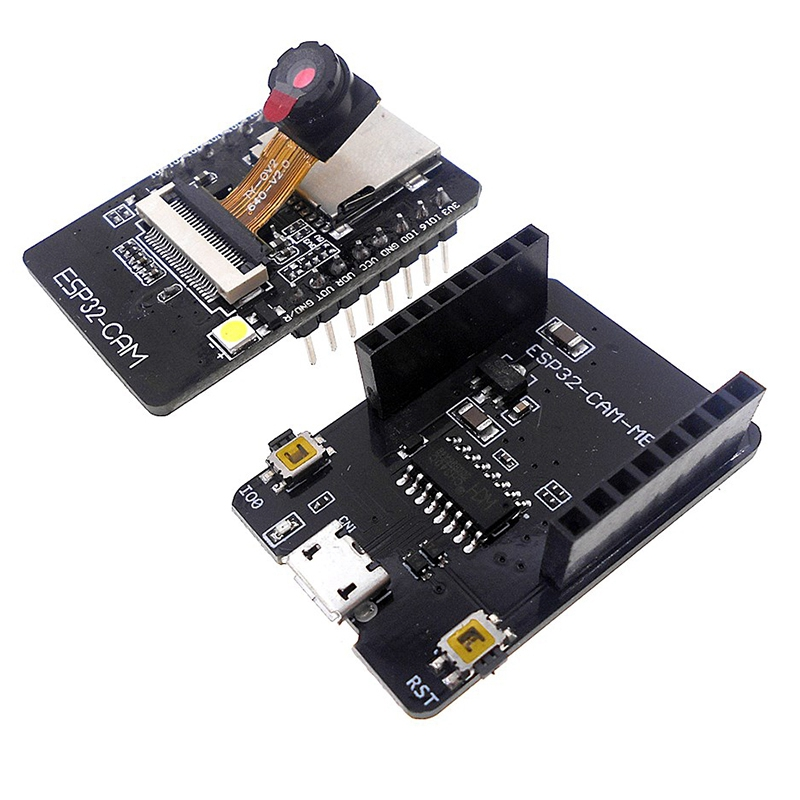
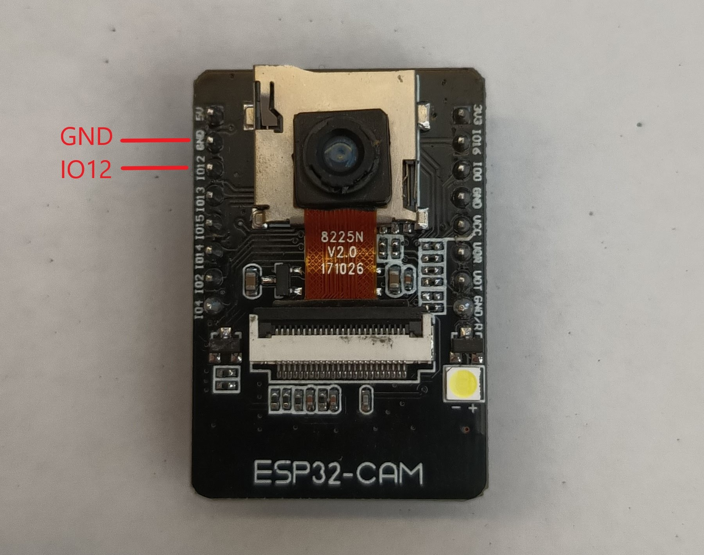
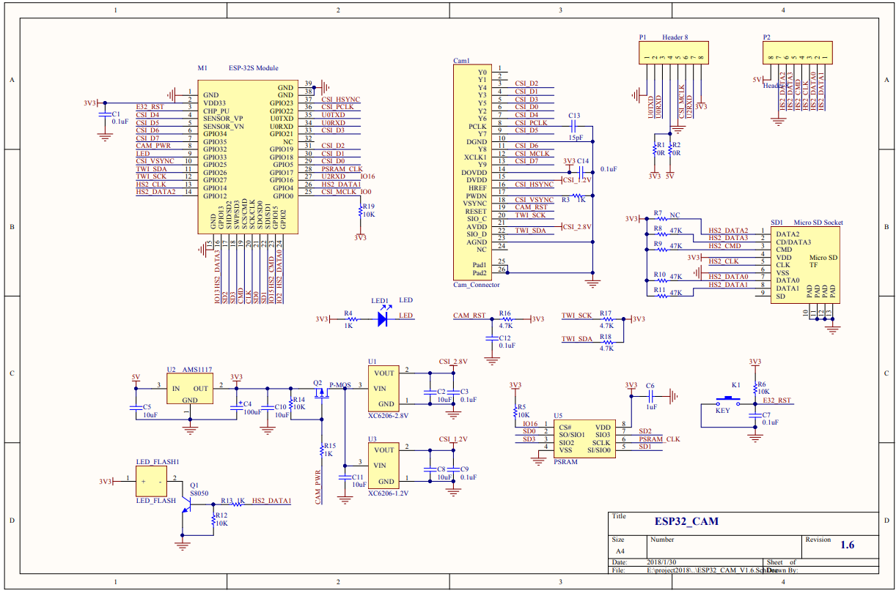
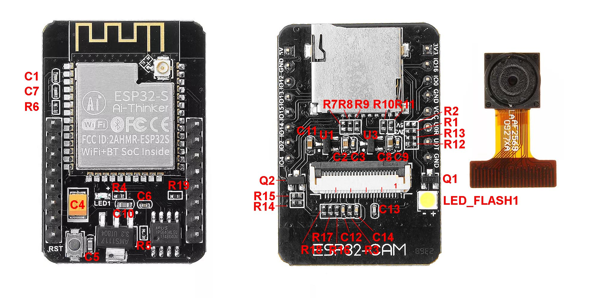
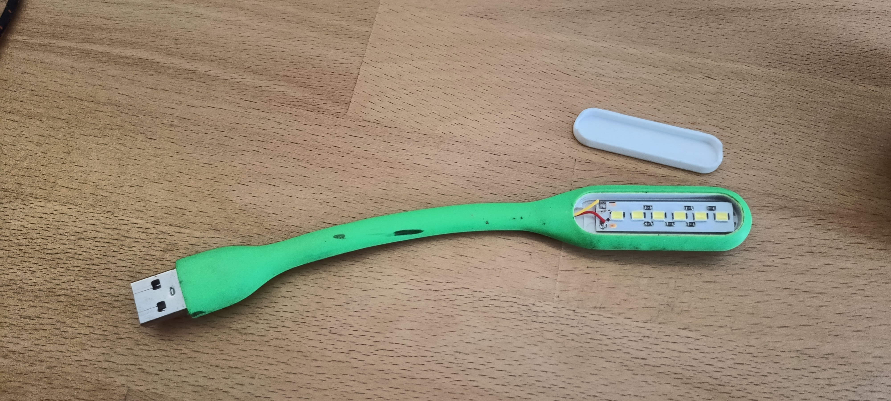
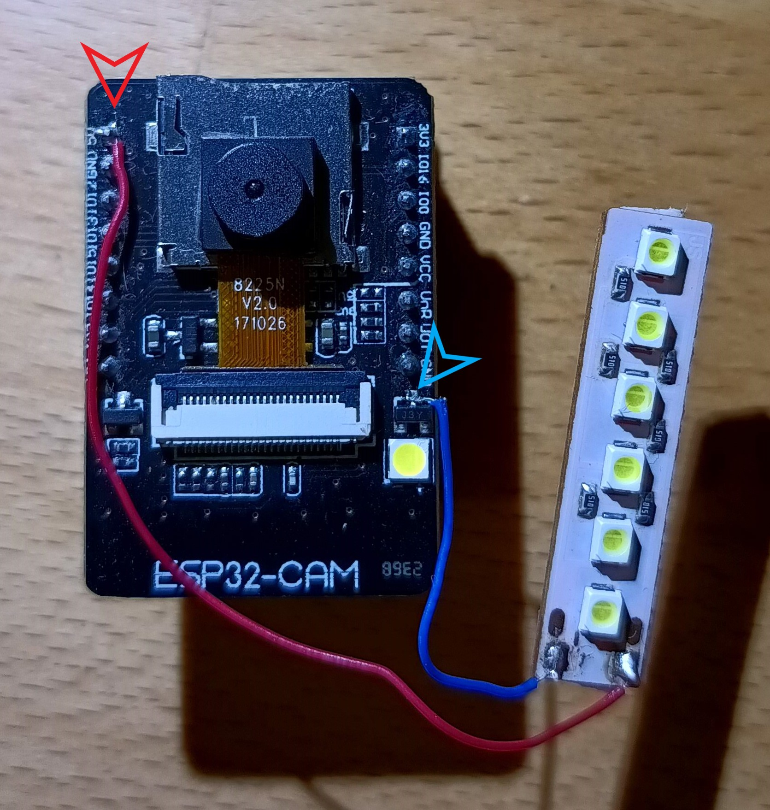

# Ai Thinker ESP32-CAM

What we need for functionality
- ESP32-CAM AI-thinker board with OV2640 camera module [ here ](#esp32)
- Supported camera modules [here](#cam_modules)
- Module board version [here](#different_mcu)
- How to flash binary files to board from Linux/MAC/Windows [ here ](#flash_fw)
- How to compile software in the Arduino IDE [ here ](#arduino_cfg)
- How to reset the configuration to factory settings [here](#factory_cfg)
- Status LED [ here ](#status_led)
- Schematic main board is [here](#schematic)
- Issue with FLASH LED on the main board [here](#led_issue)
- External WiFi antenna [here](#ext_wifi)
- Power supply [here](#power_supply)
- External temperature sensor DHT22/DHT11 [here](#ext_sens)
- Potential issue [here](#issue)

<a name="esp32"></a>
## ESP32-CAM AI-thinker board 

Basic informations:
- Low cost version
- FLASH LED on the board
- Option connecting external FLASH LED
- Micro SD card slot
- Internal WiFi antenna, after HW modification it's possible connecting external antenna
- Additional HW must be purchased for programming
- 4MB FLASH and 4MB external PSRAM
- 520 KB SRAM

It's a few dollars board with **ESP32** MCU and Camera. It's necessary to buy a board with **camera module OV2640**. The board is sold without a programmer by default. It is possible to program it using the FTDI USB to UART converter, or purchase an official programmer for the board. We recommend purchasing an official programmer. It can save a lot of trouble with connecting and programming the board. There are currently [2 different board versions](#different_mcu), but only one is compatible with the official programmer. 


In the following picture, we can see the **ESP32-CAM** board and the programator for the board. 



<a name="cam_modules"></a>
## Supported camera modules

It's necessary to use a camera version **OV2640**. If using a different camera, modification of the camera's pinout can be needed, or some camera settings may not work correctly. We recommend to use a camera module with a viewing angle of 120° or 160°.


These are currently known or tested camera modules:

| Camera chip | FOV  | Resolution | Tested | Works | Description                              |
|-------------|------|------------|--------|-------|------------------------------------------|
| OV2640      | 30°  |    2MP     |   No   |  N/A  |                                          |
| OV2640      | 44°  |    2MP     |   No   |  N/A  |                                          |
| OV2640      | 66°  |    2MP     |   Yes  |  Yes  | Recommended. Standard camera module      |
| OV2640      | 120° |    2MP     |   Yes  |  Yes  | Recommended                              |
| OV2640      | 160° |    2MP     |   Yes  |  Yes  | Recommended                              |
| OV2640      | 200° |    2MP     |   No   |  N/A  |                                          |
| OV2640      | 222° |    2MP     |   No   |  N/A  |                                          |
| OV2640IR    | 160° |    2MP     |   Yes  |  Yes  |                                          |
| OV8225N     | 66°  |    2MP     |   Yes  |  Yes  |                                          |
| OV3360      | 66°  |    3MP     |   Yes  |  Yes  |                                          |
| OV5640-AF   | 72°  |    5MP     |   Yes  |  Yes  | Overheating, slow photo loading          |

<a name="different_mcu"></a>
## Different MCU version

There are currently 2 versions of the board, but only one version is possible programming via oficial **CH340** programmer. The blue rectangle shows the differences between the HW versions.


The red arrow points to a pin that differs between these boards. In version 1, this pin is used for **MCU RESET (GND/R)**. In version 2, this pin serves as ground **(GND)**. Version 1 can be programmed via **CH340**, whereas version 2 cannot be programmed via **CH340**. For version 2, we tested programming via **FT232RL** or **CP2102**, and the programming process worked successfully.

If we want to program the MCU without the original programmer with **CH340**, or if we want to program the second version of the board, then we need to follow the following instructions. We will need a USB to UART converter, such as **FT232**, **CP2102** or **CH340**. I have tested firmware uploading to the **ESP32-cam** with these converters. Uploading FW to the **second** version using **CH340** did not work for me. Uploading FW using **CH340** only worked for me for the first version of **ESP32-cam** board. For the next steps, I will use the **FT232RL** converter. We connect the **ESP32-cam** to the **FT232** according to the following diagram, where we connect:


- **VCC** from **FT232** to **5V** on the **ESP32-CAM**. **CAUTION!** It is necessary to observe the maximum supply voltage of the **ESP32-CAM**, otherwise irreversible damage to the **ESP32-CAM** module may occur.
- **GND** from **FT232** to **GND** on the **ESP32-CAM**
- **TX** from **FT232** to **U0R** on the **ESP32-CAM**
- **RX** from **FT232** to **U0T** on the **ESP32-CAM**
- **IO0** from **ESP32-CAM** to **GND** on **ESP32-CAM**. By connecting the **IO0** pin to **GND**, we switch the board to the mode in which it expects firmware uploading.

Next step is connect the **FT232** converter to the PC and install the correct driver. Then we proceed with uploading the firmware to the **ESP32-cam**, which is described [here](https://github.com/prusa3d/Prusa-Firmware-ESP32-Cam?tab=readme-ov-file#how-to-flash-binary-files-to-esp32-cam-board-from-linuxmacwindows). After successfully uploading the firmware to the **ESP32-cam**, we disconnect **IO0** from **GND**, disconnect the **FT232** converter from the **ESP32-CAM**, and connect the **ESP32-CAM** to the power supply.

The recommended version includes the MCU ESP32 (ESP32-S) with 520 KB of SRAM and external 4M PSRAM

<a name="flash_fw"></a>
## How to flash binary files to board from Linux/MAC/Windows

#### Partitions table for flashing FW

Here is the partitions table:

| Name    | Type    | SubType | Offset   | Size     | Flags |
|---------|---------|---------|----------|----------|-------|
| nvs     | data    | nvs     | 0x9000   | 0x5000   |       |
| otadata | data    | ota     | 0xe000   | 0x2000   |       |
| app0    | app     | ota_0   | 0x10000  | 0x1E0000 |       |
| app1    | app     | ota_1   | 0x1F0000 | 0x1E0000 |       |
| spiffs  | data    | spiffs  | 0x3D0000 | 0x20000  |       |
| coredump| data    | coredump| 0x3F0000 | 0x10000  |       |

However, for uploading the firmware, it's important to use this configuration of addresses and files:

ZIP file with build binary files: **esp32-cam.zip**

- address **0x1000** - **ESP32_PrusaConnectCam.ino.bootloader.bin**
- address **0x8000** - **ESP32_PrusaConnectCam.ino.partitions.bin**
- address **0x10000** - **ESP32_PrusaConnectCam.ino.bin**

**It is important to download the correct binary files! Each type of camera has its own ZIP archive with files for uploading the firmware.**

#### Linux/MAC

You must use the console to upload the firmware on the MAC or Linux platform. First, ensure you have installed esptool for Python. You can find it on the manufacturer's website, ESPRESSIF, [here](https://docs.espressif.com/projects/esp-at/en/latest/esp32/Get_Started/Downloading_guide.html#linux-or-macos).

And command for FLASH FW is here, where **/dev/ttya0** is your serial interface for communication with the ESP32-cam board. This is the command for the first flash FW to MCU.

```
./esptool -p /dev/ttya0 -b 460800 --before default_reset --after hard_reset --chip esp32 write_flash --erase-all --flash_mode dio --flash_size 4MB --flash_freq 80m 0x1000 ESP32_PrusaConnectCam.ino.bootloader.bin 0x8000 ESP32_PrusaConnectCam.ino.partitions.bin 0x10000 ESP32_PrusaConnectCam.ino.bin
```

This command contains the parameter **--eras-all**, which erases the entire flash in the MCU. So, for just updating the firmware, it is necessary to remove the parameter **--eras-all**; otherwise, the MCU configuration will also be deleted. The basic command list can be found [here](https://docs.espressif.com/projects/esptool/en/latest/esp32s3/esptool/basic-commands.html)

Here is the command for updating the firmware in the MCU without erasing the MCU configuration

```
./esptool -p /dev/ttya0 -b 460800 --before default_reset --after hard_reset --chip esp32 write_flash --flash_mode dio --flash_size 4MB --flash_freq 80m 0x1000 ESP32_PrusaConnectCam.ino.bootloader.bin 0x8000 ESP32_PrusaConnectCam.ino.partitions.bin 0x10000 ESP32_PrusaConnectCam.ino.bin
```

Launching the esptool application may be different in different operating systems

#### Windows

Driver for CH340 USB to UART convert for Windows is for example [here](https://www.wch-ic.com/search?q=CH340&t=downloads) . An older version of the driver is for example [here](https://blog.laskakit.cz/wp-content/uploads/2020/03/CH341SER.zip). SW for FW flash (Flash Download Tools) is [here](https://www.espressif.com/en/support/download/other-tools)


It's necessary to erase the FLASH using the **ERASE** button before the first firmware flash.


<a name="arduino_cfg"></a>
## How to compile software in the Arduino IDE

Board configuration in the Arduino IDE 2.3.2
- Tools -> Board -> ESP32 Arduino -> AI Thinker ESP32
- Tools -> Flash frequency -> 80MHz
- Tools -> Core Debug Level -> None
- Tools -> Erase all Flash Before Sketch Upload -> Disable **(first flash, new board = enable. otherwise = disable)**
- Tools -> Flash Mode -> DIO
- Tools -> Partition scheme -> Minimal SPIFFS (1.9MB APP with OTA/190KB SPIFFS)

When flashing the firmware to a new, empty ESP32-CAM device for the first time, it is necessary to use the 'Erase' function. 

This can be found under **Tools** -> **Erase all Flash Before Sketch Upload** -> **Enable**. 

After the initial firmware upload to the MCU, it's necessary to disable this option. If you do not disable this option, your camera configuration will continue to be erased from the flash memory after uploading new firmware from the Arduino IDE.

It is necessary to enable support for the correct board version in the file **mcu_cfg.h** after line 16.

<a name="factory_cfg"></a>
## How to reset configuration to factory settings
To reset the settings to factory defaults, follow these instructions:



- Connect PIN **IO12** to **ground**.
- **Plug in** the power supply.
- Wait for **10 seconds**.
- After 10 seconds, the **FLASH LED will start flashing**.
- **Disconnect** PIN **IO12** from **ground** (but don't disconnect the power supply).
- After disconnecting **IO12** from **ground**, the **FLASH LED** will **stop flashing**, and the MCU will **automatically reboot**.
- Now the MCU is in the factory settings.

<a name="status_led"></a>
## Status LED

On the board, there is a status LED that provides a visual indicator of the module's current status
through blinking at defined intervals.


Upon module activation, the LED illuminates. After processor initialization, the LED exhibits different blinking intervals based on the current mode of the module

- **Service AP Mode only:** The LED blinks every **400 ms**, indicating the module's availability in service AP mode.
- **Connecting to WiFi AP:** While connecting to a WiFi Access Point, the LED blinks at intervals of **800 ms**.
- **Connected to WiFi Network:** Upon successful connection to a WiFi network, the LED blinks at intervals of **4000 ms**, signaling a stable connection.
- **Problematic State:** If an issue or error occurs, the LED accelerates its blinking to every **100 ms**.

The approximate boot time of the device is 15-20 seconds.

<a name="schematic"></a>
## Schematic for ESP32-cam board



Board description



Pinout


<a name="led_issue"></a>
## FLASH LED issue
The board has a problem with the FLASH LED, as it lacks any current limitation for the LED. Consequently, frequent use of the FLASH LED can lead to malfunction, due to excessive current flow.

One simple solution is to connect an external LED via a relay, transistor, or MOSFET to the board, as shown in the next picture. Using a relay is not ideal, but it provides a simple solution.


Another solution is to use an LED COB or a USB LED lamp. I utilized a board from a simple USB LED lamp. The transistor has a current limitation of 500mA, and my USB lamp has a current consumption of approximately 180mA. The original LED has a current consumption of 60-80mA. After calculation, the total current consumption is approximately 260mA, which falls within the current limitation of the transistor. Therefore, it is possible to solder the negative wire from the COB LED or the USB LED lamp to the transistor. The positive wire needs to be soldered to +5V.

This is my USB LED lamp



The next step is to solder the negative wire from the LED lamp to the transistor collector, and the positive wire from the LED lamp to the +5V on the board.



The third option is to solder a resistor between the collector of the transistor and the PCB. I used a 10-ohm resistor in a 0603 package. This option is more complicated for users with limited soldering experience.


<a name="ext_wifi"></a>
## External/internal WiFi antenna

The standard ESP32-CAM board utilizes an internal antenna on the PCB. However, this antenna can sometimes cause issues with the quality of the WiFi signal, leading to slow photo uploads to PrusaConnect or connectivity problems. Fortunately, there is an option to connect an external antenna. This requires changing the resistor position, as shown in the picture below. Then, you can use a 2.4GHz Wi-Fi cable with a U.FL to RP-SMA connector and a standard 2.4GHz WiFi antenna


<a name="power_supply"></a>
## Power Supply

The device requires a 5V power supply, with a maximum current consumption of 2A. Power is supplied via a micro USB connector when using the original programmer.

<a name="ext_sens"></a>
## External temperature sensor DHT22/DHT11

Below you will find the wiring diagram for the DHT22 or DHT11 sensor.

| Camera board | DHT22/DHT11 |
|--------------|-------------|
| 3.3V         | VCC         |
| GND          | GND         |
| IO13         | Data        |


<a name="issue"></a>
## Potential issue with this board

- The flash LED may fail after some time due to the absence of a current-limiting resistor.
- The WiFi signal quality on this board may be weaker compared to other boards and may degrade over time.
