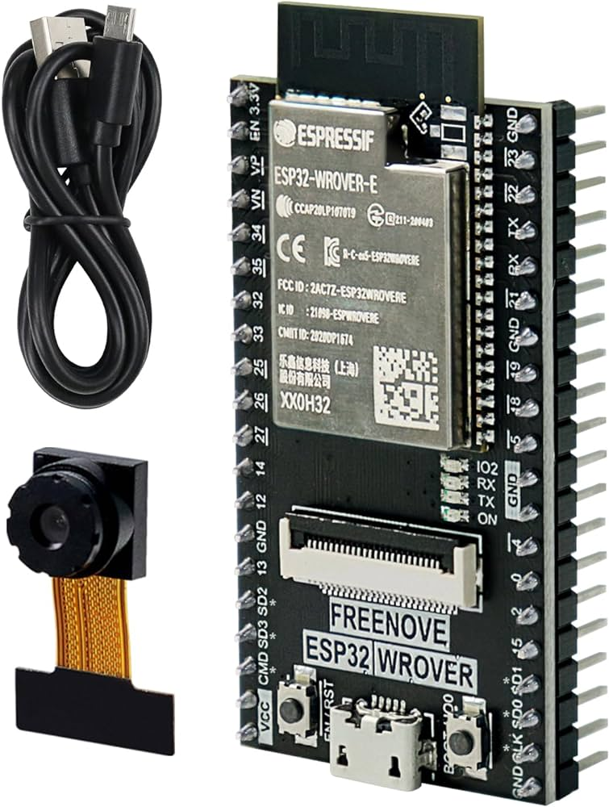
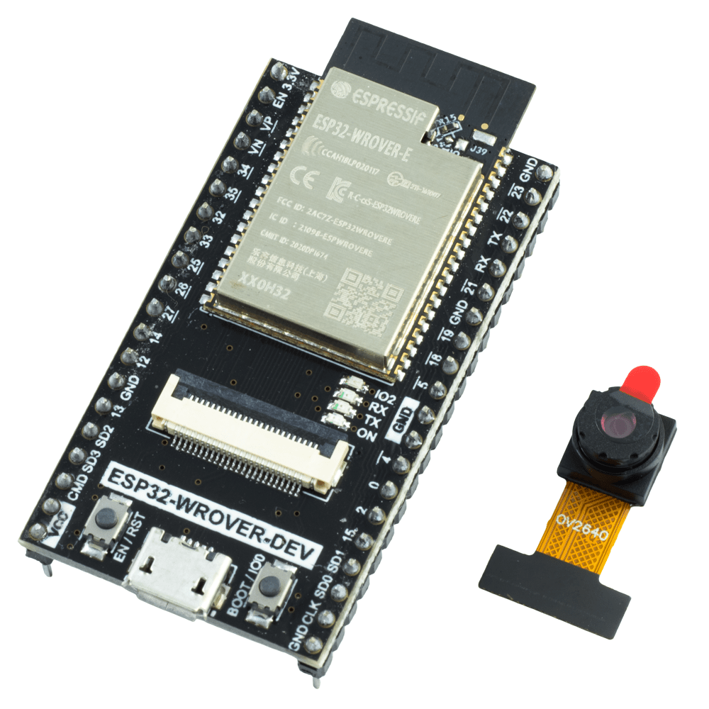
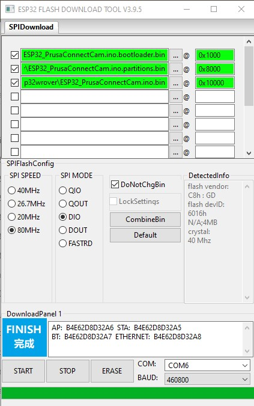
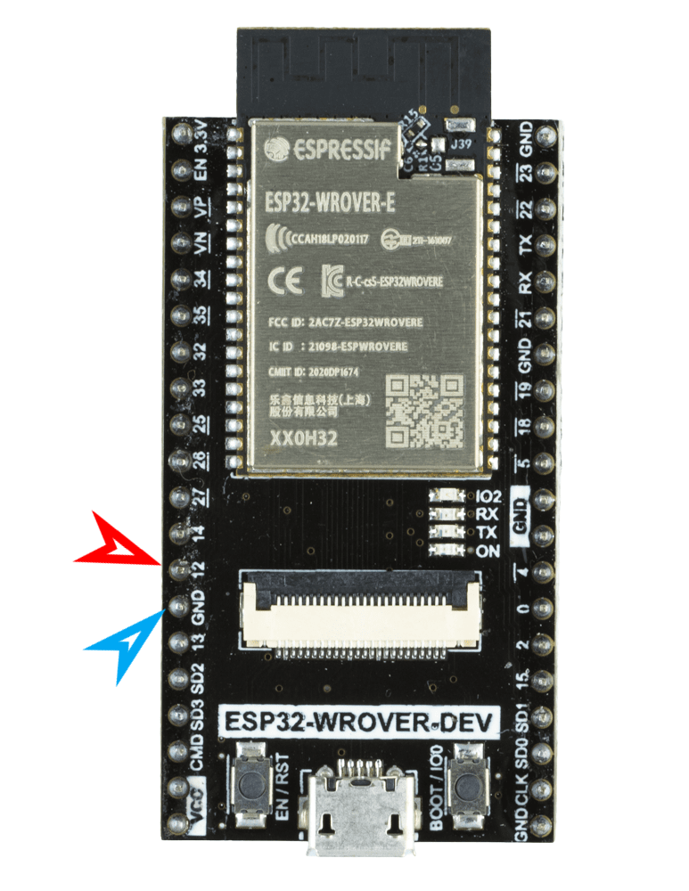
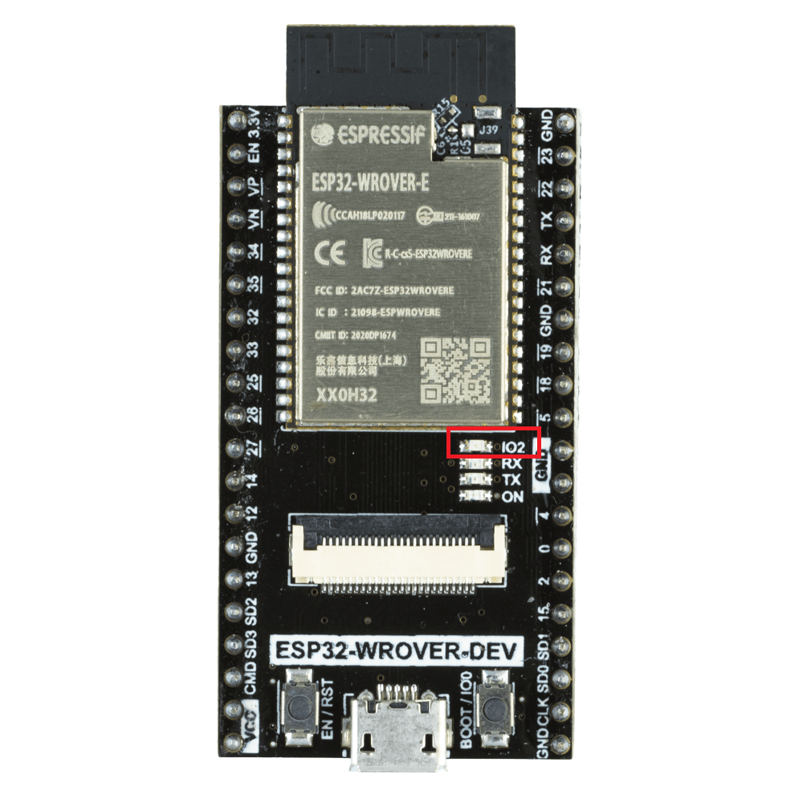
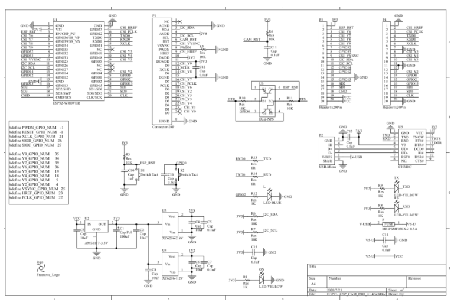
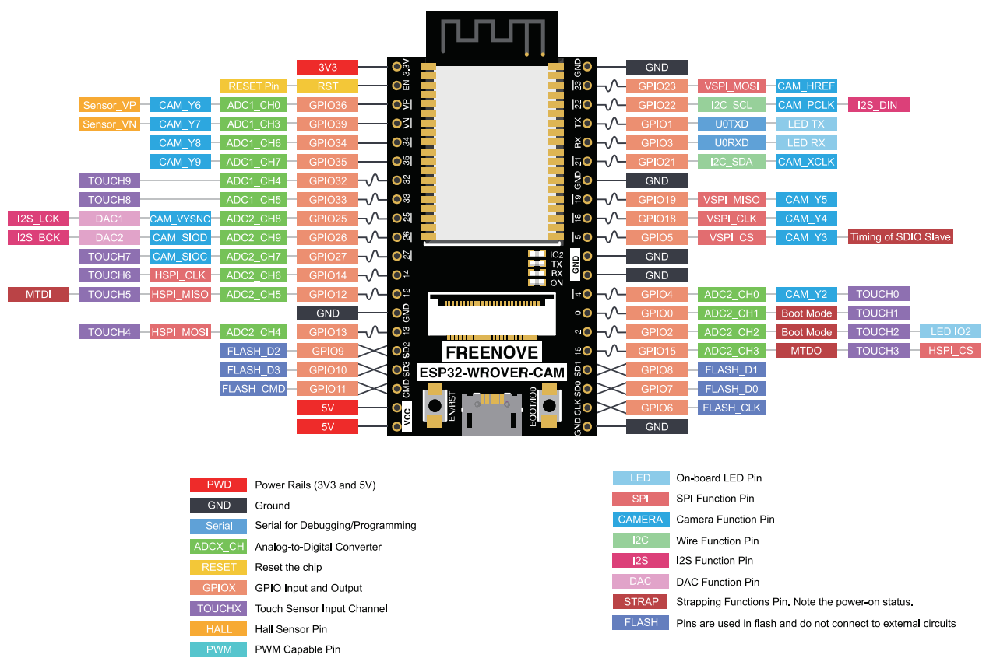
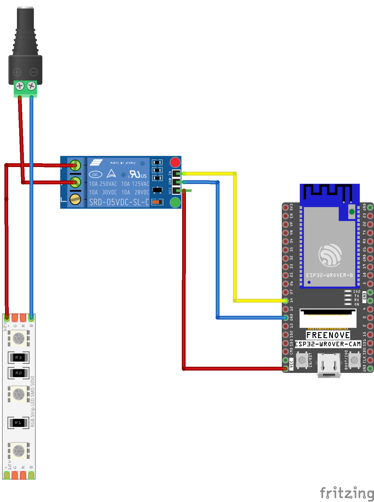
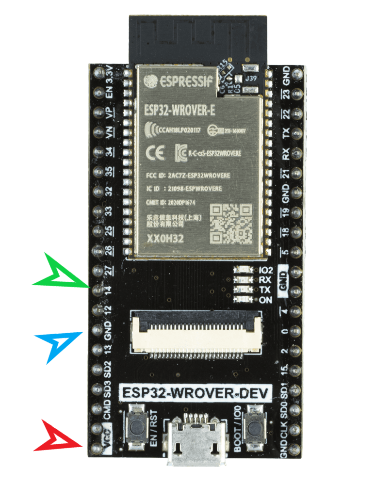
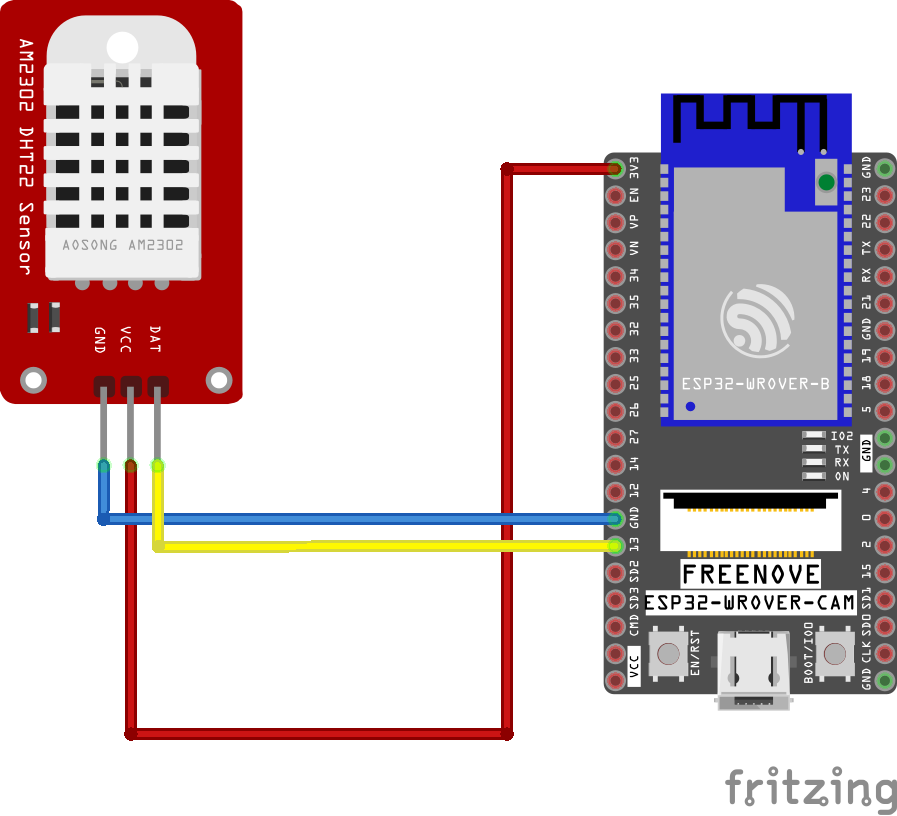

# Freenove ESP32-Wrover-CAM

What we need for functionality
- Freenove ESP32-Wrover-CAM [ here ](#esp32)
- Supported camera modules [here](#cam_modules)
- Module board version [here](#different_mcu)
- How to flash binary files to board from Linux/MAC/Windows [ here ](#flash_fw)
- How to compile software in the Arduino IDE [ here ](#arduino_cfg)
- How to reset the configuration to factory settings [here](#factory_cfg)
- Status LED [ here ](#status_led)
- Board schematic [here](#schematic)
- External FLASH LED [here](#led_issue)
- Power supply [here](#power_supply)
- External temperature sensor DHT22/DHT11 [here](#ext_sens)
- Potential issue [here](#issue)

<a name="esp32"></a>
## Freenove ESP32-Wrover-CAM

Basic informations:
- On the board missing LED for flash
- Option connecting external FLASH LED
- Missing micro SD card slot
- Internal WiFi antenna
- no additional HW is needed for programming
- 4MB FLASH and 4MB external PSRAM
- 520 KB SRAM
- Excellent WiFi signal

This board version is built on the same processor, ESP32, as the AiThinker ESP32-CAM. However, a different module with the processor is used in this version. The board missing a LED for FLASH and a Micro SD card slot. The board has an internal WiFi antenna, which has better WiFi signal quality than the AiThinker ESP32-CAM board.



<a name="cam_modules"></a>
## Supported camera modules

It's necessary to use a camera version **OV2640**. If using a different camera, modification of the camera's pinout can be needed, or some camera settings may not work correctly. We recommend to use a camera module with a viewing angle of 120° or 160°.

These are currently known or tested camera modules:

| Camera chip | FOV  | Resolution | Tested | Works | Description                              |
|-------------|------|------------|--------|-------|------------------------------------------|
| OV2640      | 30°  |    2MP     |   No   |  N/A  |                                          |
| OV2640      | 44°  |    2MP     |   No   |  N/A  |                                          |
| OV2640      | 66°  |    2MP     |   Yes  |  Yes  | Recommended. Standard camera module      |
| OV2640      | 120° |    2MP     |   Yes  |  Yes  | Recommended                              |
| OV2640      | 160° |    2MP     |   Yes  |  Yes  | Recommended                              |
| OV2640      | 200° |    2MP     |   No   |  N/A  |                                          |
| OV2640      | 222° |    2MP     |   No   |  N/A  |                                          |
| OV2640IR    | 160° |    2MP     |   Yes  |  Yes  |                                          |
| OV8225N     | 66°  |    2MP     |   Yes  |  Yes  |                                          |
| OV3360      | 66°  |    3MP     |   Yes  |  Yes  |                                          |
| OV5640-AF   | 72°  |    5MP     |   Yes  |  Yes  | Overheating, slow photo loading          |

<a name="different_mcu"></a>
## Different MCU version

There are several versions of the boards. A clone was used for software testing. I assume that the original version and the clone do not differ, and the software will work on both in the same way.

The original board version contain brand **FREENOVE**


On the clone **FREENOVE** brand missing



<a name="flash_fw"></a>
## How to flash binary files to board from Linux/MAC/Windows

#### Partitions table for flashing FW

For uploading the firmware, it's important to use this configuration of addresses and files:

ZIP file with build binary files: **esp32-wrover-dev.zip**

- address **0x1000** - **ESP32_PrusaConnectCam.ino.bootloader.bin**
- address **0x8000** - **ESP32_PrusaConnectCam.ino.partitions.bin**
- address **0x10000** - **ESP32_PrusaConnectCam.ino.bin**

**It is important to download the correct binary files! Each type of camera has its own ZIP archive with files for uploading the firmware.**

#### Linux/MAC

You must use the console to upload the firmware on the MAC or Linux platform. First, ensure you have installed esptool for Python. You can find it on the manufacturer's website, ESPRESSIF, [here](https://docs.espressif.com/projects/esp-at/en/latest/esp32/Get_Started/Downloading_guide.html#linux-or-macos).

And command for FLASH FW is here, where **/dev/ttya0** is your serial interface for communication with the ESP32-cam board. This is the command for the first flash FW to MCU.

```
./esptool -p /dev/ttya0 -b 460800 --before default_reset --after hard_reset --chip esp32 write_flash --erase-all --flash_mode dio --flash_size 4MB --flash_freq 80m 0x1000 ESP32_PrusaConnectCam.ino.bootloader.bin 0x8000 ESP32_PrusaConnectCam.ino.partitions.bin 0x10000 ESP32_PrusaConnectCam.ino.bin
```

This command contains the parameter **--eras-all**, which erases the entire flash in the MCU. So, for just updating the firmware, it is necessary to remove the parameter **--eras-all**; otherwise, the MCU configuration will also be deleted. The basic command list can be found [here](https://docs.espressif.com/projects/esptool/en/latest/esp32s3/esptool/basic-commands.html)

Here is the command for updating the firmware in the MCU without erasing the MCU configuration

```
./esptool -p /dev/ttya0 -b 460800 --before default_reset --after hard_reset --chip esp32 write_flash --flash_mode dio --flash_size 4MB --flash_freq 80m 0x1000 ESP32_PrusaConnectCam.ino.bootloader.bin 0x8000 ESP32_PrusaConnectCam.ino.partitions.bin 0x10000 ESP32_PrusaConnectCam.ino.bin
```

Launching the esptool application may be different in different operating systems

#### Windows

Driver for CH340 USB to UART convert for Windows is for example [here](https://www.wch-ic.com/search?q=CH340&t=downloads) . An older version of the driver is for example [here](https://blog.laskakit.cz/wp-content/uploads/2020/03/CH341SER.zip)


It's necessary to erase the FLASH using the **ERASE** button before the first firmware flash.



<a name="arduino_cfg"></a>
## How to compile software in the Arduino IDE

Board configuration in the Arduino IDE 2.3.2
- Tools -> Board -> ESP32 Arduino -> ESP32 Wrover Module
- Tools -> CPU Frequency -> 240MHz (WiFi/BT)
- Tools -> Core debug level -> None
- Tools -> Erase all Flash Before Sketch Upload -> Disable **(first flash, new board = enable. otherwise = disable)**
- Tools -> Flash frequency -> 80MHz
- Tools -> Flash Mode -> DIO
- Tools -> Partition scheme -> Minimal SPIFFS (1.9MB APP with OTA/190KB SPIFFS)
  
When flashing the firmware to a new, empty ESP32-Wrover-dev device for the first time, it is necessary to use the 'Erase' function. 

This can be found under **Tools** -> **Erase all Flash Before Sketch Upload** -> **Enable**. 

After the initial firmware upload to the MCU, it's necessary to disable this option. If you do not disable this option, your camera configuration will continue to be erased from the flash memory after uploading new firmware from the Arduino IDE.

It is necessary to enable support for the correct board version in the file **mcu_cfg.h** after line 16.

<a name="factory_cfg"></a>
## How to reset configuration to factory settings
To reset the settings to factory defaults, follow these instructions:



- Connect PIN **IO12** to **ground**.
- **Plug in** the power supply.
- Wait for **10 seconds**.
- After 10 seconds, the **STATUS LED will start flashing**.
- **Disconnect** PIN **IO12** from **ground** (but don't disconnect the power supply).
- After disconnecting **IO12** from **ground**, the **STATUS LED** will **stop flashing**, and the MCU will **automatically reboot**.
- Now the MCU is in the factory settings.

<a name="status_led"></a>
## Status LED

On the board, there is a status LED that provides a visual indicator of the module's current status
through blinking at defined intervals.



Upon module activation, the LED illuminates. After processor initialization, the LED exhibits different blinking intervals based on the current mode of the module

- **Service AP Mode only:** The LED blinks every **400 ms**, indicating the module's availability in service AP mode.
- **Connecting to WiFi AP:** While connecting to a WiFi Access Point, the LED blinks at intervals of **800 ms**.
- **Connected to WiFi Network:** Upon successful connection to a WiFi network, the LED blinks at intervals of **4000 ms**, signaling a stable connection.
- **Problematic State:** If an issue or error occurs, the LED accelerates its blinking to every **100 ms**.

The approximate boot time of the device is 15-20 seconds.

<a name="schematic"></a>
## Schematic for ESP32-cam board

Unfortunately, I was unable to obtain the schematic for this version of the board. I found a schematic online, but it is in very low resolution and is difficult to read.



And here is the pinout



<a name="led_issue"></a>
## External FLASH LED

This board version don't have **FLASH LED** on the board. Therefore, if a FLASH LED is needed, a GPIO 14 pin should be used to connect an external LED for FLASH. The FLASH LED can be connected, for example, as an LED strip using a relay. 



For the external LED is in the SW used **GPIO pin 14**.



However, a 5mm LED can also be connected directly. **CAUTION**: The digital GPIO output from the ESP32-WROVER-DEV board has a current limitation of a **maximum of 40mA**! Therefore, it is recommended to switch the LED using a **transistor** rather than directly through the GPIO pin. Improper use of the GPIO pin can lead to permanent damage.

<a name="power_supply"></a>
## Power Supply

The device requires a 5V power supply, with a maximum current consumption of 2A. Power is supplied via a micro USB connector when using the original programmer.

<a name="ext_sens"></a>
## External temperature sensor DHT22/DHT11

Below you will find the wiring diagram for the DHT22 or DHT11 sensor.

| Camera board | DHT22/DHT11 |
|--------------|-------------|
| 3.3V         | VCC         |
| GND          | GND         |
| IO13         | Data        |



<a name="issue"></a>
## Potential issue with this board
- This version does not have a slot for a Micro SD card, so it may be complicated to obtain logs from it.

