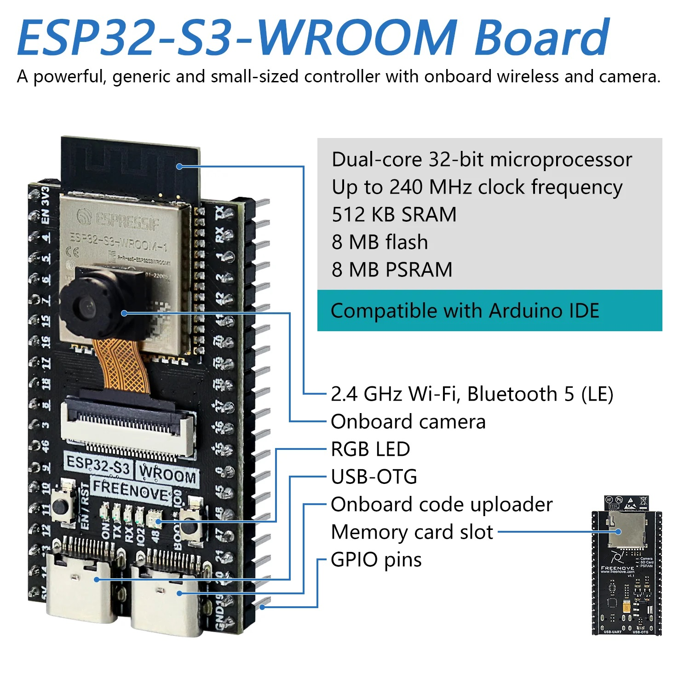
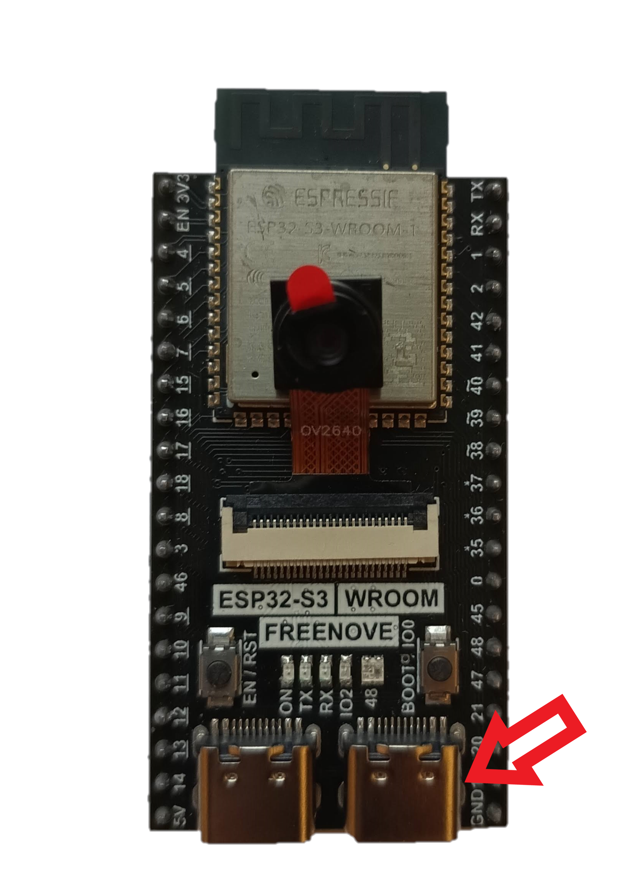
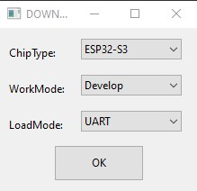
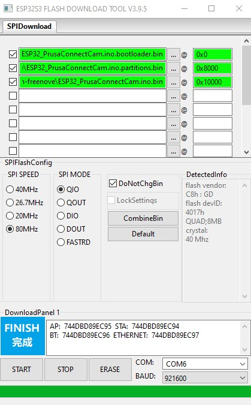
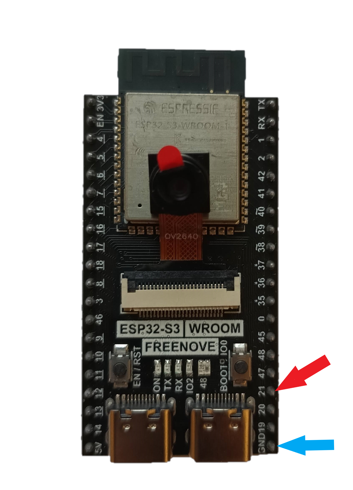
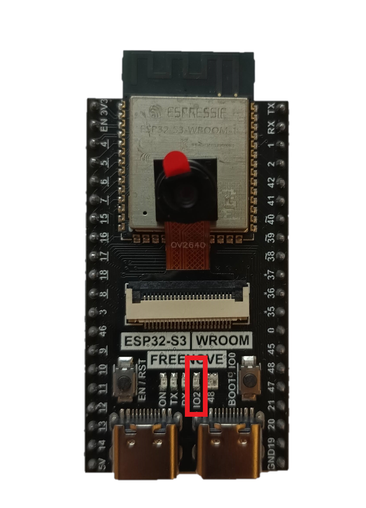
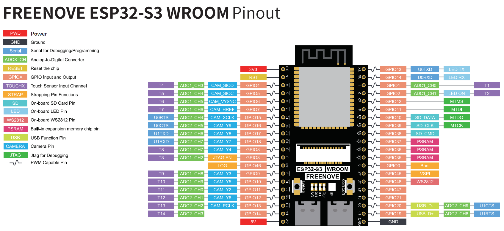
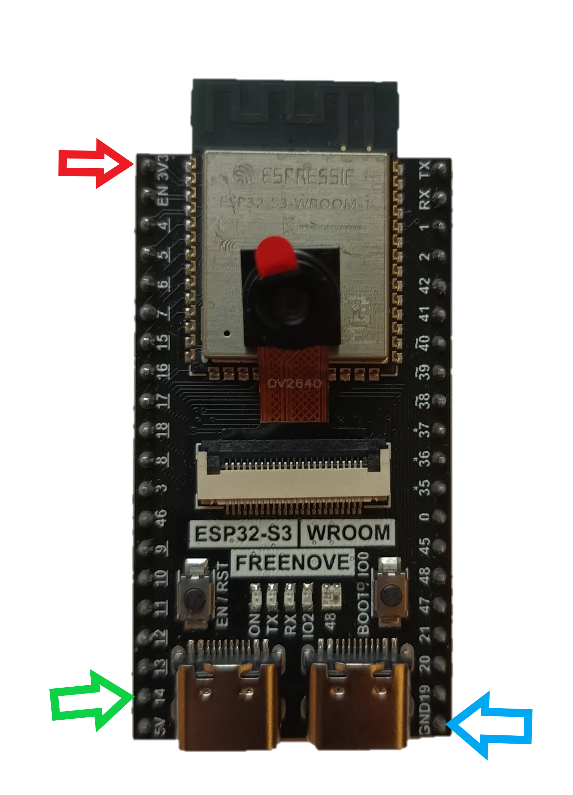
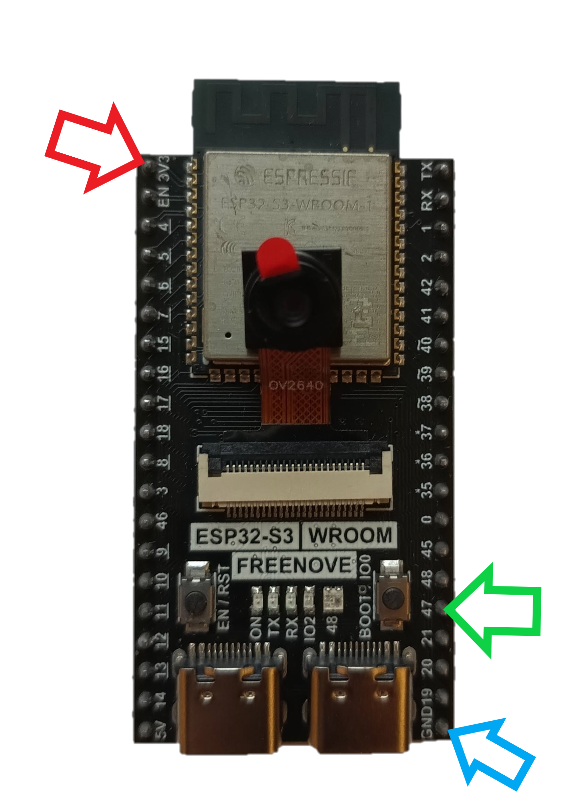

# Freenove ESP32-S3 WROOM

What we need for functionality
- Freenove ESP32-S3 WROOM board with OV2640 camera module [ here ](#esp32)
- Supported camera modules [here](cam_modules)
- How to flash binary files to board from Linux/MAC/Windows [ here ](#flash_fw)
- How to compile software in the Arduino IDE [ here ](#arduino_cfg)
- How to reset the configuration to factory settings [here](#factory_cfg)
- Status LED [ here ](#status_led)
- Schematic main board is [here](#schematic)
- FLASH LED issue [here](#flash-led-issue)
- Power supply [here](#power_supply)
- External temperature sensor DHT22/DHT11 [here](#ext_sens)
- Potential issue [here](#issue)

<a name="esp32"></a>
## Freenove ESP32-S3 WROOM

Basic information:
- On the board is LED ws2812b for flash
- Option connecting external FLASH LED
- Micro SD card slot
- Internal WiFi antenna
- no additional HW is needed for programming
- 8MB FLASH and 8MB external PSRAM
- Excellent WiFi signal

This is a more expensive version with a more powerful ESP32-S3 processor. The board is sold with an OV2640 camera module. No additional hardware is required for programming. The ESP32-S3 processor is programmed via the processor's USB interface.



<a name="cam_modules"></a>
## Supported camera modules

The board is officially sold with an OV2640 camera module with 66.5° field of view.

These are currently known or tested camera modules:

| Camera chip | FOV    | Resolution | Tested | Works | Description                              |
|-------------|--------|------------|--------|-------|------------------------------------------|
| OV2640      | 66.5°  |    2MP     |   Yes  |  Yes  | Recommended. Standard camera module      |
| OV2640      | 120°   |    2MP     |   Yes  |  Yes  | Recommended                              |
| OV2640      | 160°   |    2MP     |   Yes  |  Yes  | Recommended                              |
| OV2640IR    | 160°   |    2MP     |   Yes  |  Yes  |                                          |

<a name="flash_fw"></a>
## How to flash binary files to board from Linux/MAC/Windows

For programming we will use the right USB-C connector



#### Partitions table for flashing FW

For uploading the firmware, it's important to use this configuration of addresses and files:

ZIP file with build binary files: **esp32-s3-wroom-freenove.zip**

- address **0x0** - **ESP32_PrusaConnectCam.ino.bootloader.bin**
- address **0x8000** - **ESP32_PrusaConnectCam.ino.partitions.bin**
- address **0x10000** - **ESP32_PrusaConnectCam.ino.bin**

**It is important to download the correct binary files! Each type of camera has its own ZIP archive with files for uploading the firmware.**

#### Linux/MAC

You must use the console to upload the firmware on the MAC or Linux platform. First, ensure you have installed esptool for Python. You can find it on the manufacturer's website, ESPRESSIF, [here](https://docs.espressif.com/projects/esp-at/en/latest/esp32/Get_Started/Downloading_guide.html#linux-or-macos).

And command for FLASH FW is here, where **/dev/ttya0** is your serial interface for communication with the ESP32-cam board. This is the command for the first flash FW to MCU.

```
./esptool --chip esp32s3 -p /dev/ttya0 -b 921600 --before default_reset --after hard_reset  write_flash --erase-all --flash_mode qio --flash_size 8MB --flash_freq 80m 0x0 ESP32_PrusaConnectCam.ino.bootloader.bin 0x8000 ESP32_PrusaConnectCam.ino.partitions.bin 0x10000 ESP32_PrusaConnectCam.ino.bin
```

This command contains the parameter **--erase-all**, which erases the entire flash in the MCU. So, for just updating the firmware, it is necessary to remove the parameter **--erase-all**; otherwise, the MCU configuration will also be deleted. The basic command list can be found [here](https://docs.espressif.com/projects/esptool/en/latest/esp32s3/esptool/basic-commands.html)

Here is the command for updating the firmware in the MCU without erasing the MCU configuration

```
./esptool --chip esp32s3 -p /dev/ttya0 -b 921600 --before default_reset --after hard_reset  write_flash --flash_mode qio --flash_size 8MB --flash_freq 80m 0x0 ESP32_PrusaConnectCam.ino.bootloader.bin 0x8000 ESP32_PrusaConnectCam.ino.partitions.bin 0x10000 ESP32_PrusaConnectCam.ino.bin
```

Launching the esptool application may be different in different operating systems

#### Windows

The driver should be installed automatically by Windows. SW for FW flash (Flash Download Tools) is [here](https://www.espressif.com/en/support/download/other-tools)

In the first step, you need to open the application **flash download tool**, and select MCU version



Then, select the communication port. It's necessary to erase the FLASH using the **ERASE** button before the first firmware flash. 

It's necessary to erase the FLASH using the **ERASE** button before the first firmware flash.



<a name="arduino_cfg"></a>
## How to compile software in the Arduino IDE

Board configuration in the Arduino IDE 2.3.2
- Tools -> Board -> ESP32 Arduino -> ESP32S3 Dev Module
- Tools -> USB CDC on BOOT -> Disabled
- Tools -> CPU Frequency -> 240MHz (WiFi/BT)
- Tools -> Core debug level -> None
- Tools -> USB DFU on BOOT -> Disable
- Tools -> Erase all Flash Before Sketch Upload -> Disable (first flash, new board = enable. otherwise = disable)
- Tools -> Events Run On -> Core 0
- Tools -> Flash Mode -> QIO 80MHz
- Tools -> Flash Size -> 8MB
- Tools -> Jtag Adapter -> Disable
- Tools -> Arduino Runs On -> Core 0
- Tools -> USB Firmware MSC On Boot -> Disable
- Tools -> Partition scheme -> Minimal SPIFFS (1.9MB APP with OTA/190KB SPIFFS)
- Tools -> PSRAM -> OPI PSRAM
- Tools -> Upload Mode -> UART0 / Hardware CDC
- Tools -> Upload Speed -> 921600
- Tools -> USB Mode -> Hardware CDC and JTAG
- Tools -> Zigbee mode -> Disable

When flashing the firmware to a new, empty Freenove ESP32-S3-Wroom device for the first time, it is necessary to use the 'Erase' function. 

This can be found under **Tools** -> **Erase all Flash Before Sketch Upload** -> **Enable**. 

After the initial firmware upload to the MCU, it's necessary to disable this option. If you do not disable this option, your camera configuration will continue to be erased from the flash memory after uploading new firmware from the Arduino IDE.

It is necessary to enable support for the correct board version in the file **mcu_cfg.h** after line 16.

<a name="factory_cfg"></a>
## How to reset configuration to factory settings
To reset the settings to factory defaults, follow these instructions:



- Connect PIN **21** (red) to **ground** (blue).
- **Plug in** the power supply.
- Wait for **10 seconds**.
- After 10 seconds, the **STATUS LED will start flashing**.
- **Disconnect** PIN **21** from **ground** (but don't disconnect the power supply).
- After disconnecting **21** from **ground**, the **STATUS LED** will stop flashing, and the MCU will automatically reboot.
- Now the MCU is in the factory settings.

<a name="status_led"></a>
## Status LED

On the board, there is a status LED that provides a visual indicator of the module's current status
through blinking at defined intervals.



Upon module activation, the LED illuminates. After processor initialization, the LED exhibits different blinking intervals based on the current mode of the module

- **Service AP Mode only:** The LED blinks every **400 ms**, indicating the module's availability in service AP mode.
- **Connecting to WiFi AP:** While connecting to a WiFi Access Point, the LED blinks at intervals of **800 ms**.
- **Connected to WiFi Network:** Upon successful connection to a WiFi network, the LED blinks at intervals of **4000 ms**, signaling a stable connection.
- **Problematic State:** If an issue or error occurs, the LED accelerates its blinking to every **100 ms**.

The approximate boot time of the device is 15-20 seconds.

<a name="schematic"></a>
## Schematic for ESP32-cam board

For the board existing only pinout. I don't found schematic



<a name="led_issue"></a>
## FLASH LED issue

The board does not have an LED that could serve as a camera flash. However, there is an option to use PIN 48, which is typically used to turn on the backlight of the LCD display, as a camera flash. The image shows 3 arrows:

- Green, PIN 14
- RED, VCC 3.3V
- BLUE, GND
  


<a name="power_supply"></a>
## Power Supply

The device requires a 5V power supply, with a maximum current consumption of 2A. Power is supplied via a micro USB connector when using the original programmer.

<a name="ext_sens"></a>
## External temperature sensor DHT22/DHT11
Below you will find the wiring diagram for the DHT22 or DHT11 sensor.

| Camera board | DHT22/DHT11 |
|--------------|-------------|
| 3.3V (red)   | VCC         |
| GND  (blue)  | GND         |
| IO47 (green) | Data        |



<a name="issue"></a>
## Potential issue with this board
