# Seeed Studio XIAO ESP32S3 sense cam

What we need for functionality
- XIAO ESP32-S3 Sense board with OV2640 camera module [ here ](#esp32)
- Supported camera modules [here](#cam_modules)
- Module board version [here](#different_mcu)
- How to flash binary files to board from Linux/MAC/Windows [ here ](#flash_fw)
- How to compile software in the Arduino IDE [ here ](#arduino_cfg)
- How to reset the configuration to factory settings [here](#factory_cfg)
- Status LED [ here ](#status_led)
- Schematic main board is [here](#schematic)
- Issue with FLASH LED on the main board [here](#led_issue)
- External WiFi antenna [here](#ext_wifi)
- Power supply [here](#power_supply)
- External temperature sensor DHT22/DHT11 [here](#ext_sens)
- Potential issue [here](#issue)

<a name="esp32"></a>
##  XIAO ESP32S3 sense board 

Basic informations:
- Option connecting external FLASH LED
- Micro SD card slot
- External WiFi antena
- 8MB FLASH and 8MB external PSRAM
- 520 KB SRAM
- Small dimension 21 x 17.5 x 15mm (with expansion board)
- Potential overheating issue. Possibility to attach a small aluminum heatsink to the back.
- Excellent WiFi signal

This is a small module with an ESP32-S3 processor. The camera consists of two boards: a base board with the processor and an expansion board with the camera and a slot for a micro SD card. The board uses a USB-C connector. The small size of the board is an advantage, but it can also cause overheating. To improve cooling, a small aluminum heatsink can be attached to the back of the base board.

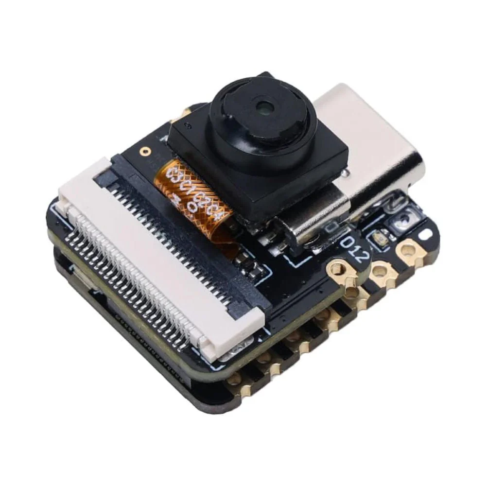

Since the camera consists of two boards and the camera part with the micro SD card is connected via a connector, potential problems with detecting the camera or SD card may arise due to poor connector engagement between the boards.

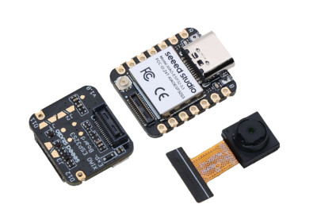

<a name="cam_modules"></a>
## Supported camera modules

It's necessary to use a camera version **OV2640**. If using a different camera, modification of the camera's pinout can be needed, or some camera settings may not work correctly. We recommend to use a camera module with a viewing angle of 120° or 160°.

These are currently known or tested camera modules:

| Camera chip | FOV  | Resolution | Tested | Works | Description                              |
|-------------|------|------------|--------|-------|------------------------------------------|
| OV2640      | 66°  |    2MP     |   Yes  |  Yes  | Recommended. Standard camera module      |
| OV2640      | 120° |    2MP     |   Yes  |  Yes  | Recommended                              |
| OV2640      | 160° |    2MP     |   Yes  |  Yes  | Recommended                              |

<a name="flash_fw"></a>
## How to flash binary files to board from Linux/MAC/Windows

#### Partitions table for flashing FW

However, for uploading the firmware, it's important to use this configuration of addresses and files:

ZIP file with build binary files: **xiao-esp32-s3.zip**

- address 0x0 - ESP32_PrusaConnectCam.ino.bootloader.bin
- address 0x8000 - ESP32_PrusaConnectCam.ino.partitions.bin
- address 0x10000 - ESP32_PrusaConnectCam.ino.bin

**It is important to download the correct binary files! Each type of camera has its own ZIP archive with files for uploading the firmware.**

#### Linux/MAC

You must use the console to upload the firmware on the MAC or Linux platform. First, ensure you have installed esptool for Python. You can find it on the manufacturer's website, ESPRESSIF, [here](https://docs.espressif.com/projects/esp-at/en/latest/esp32/Get_Started/Downloading_guide.html#linux-or-macos).

And command for FLASH FW is here, where **/dev/ttya0** is your serial interface for communication with the ESP32-cam board. This is the command for the first flash FW to MCU.

```
./esptool --chip esp32s3 -p /dev/ttya0 -b 921600 --before default_reset --after hard_reset  write_flash --erase-all --flash_mode qio --flash_size 8MB --flash_freq 80m 0x0 ESP32_PrusaConnectCam.ino.bootloader.bin 0x8000 ESP32_PrusaConnectCam.ino.partitions.bin 0x10000 ESP32_PrusaConnectCam.ino.bin
```

This command contains the parameter **--eras-all**, which erases the entire flash in the MCU. So, for just updating the firmware, it is necessary to remove the parameter **--eras-all**; otherwise, the MCU configuration will also be deleted. The basic command list can be found [here](https://docs.espressif.com/projects/esptool/en/latest/esp32s3/esptool/basic-commands.html)

Here is the command for updating the firmware in the MCU without erasing the MCU configuration

```
./esptool --chip esp32s3 -p /dev/ttya0 -b 921600 --before default_reset --after hard_reset  write_flash --flash_mode qio --flash_size 8MB --flash_freq 80m 0x0 ESP32_PrusaConnectCam.ino.bootloader.bin 0x8000 ESP32_PrusaConnectCam.ino.partitions.bin 0x10000 ESP32_PrusaConnectCam.ino.bin
```

Launching the esptool application may be different in different operating systems

#### Windows

The driver should be installed automatically by Windows. SW for FW flash (Flash Download Tools) is [here](https://www.espressif.com/en/support/download/other-tools)

In the first step, you need to open the application **flash download tool**, and select MCU version

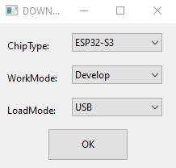

Then, select the communication port. It's necessary to erase the FLASH using the ERASE button before the first firmware flash.

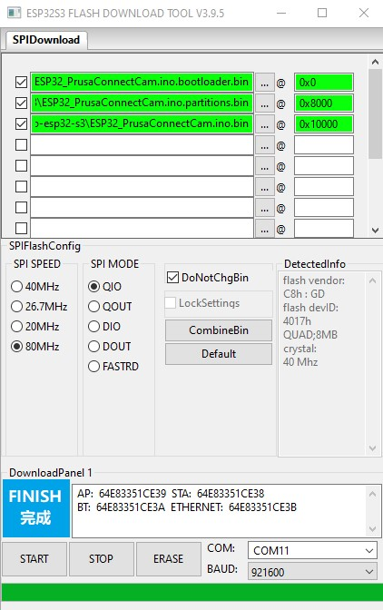

<a name="arduino_cfg"></a>
## How to compile software in the Arduino IDE

Board configuration in the Arduino IDE 2.3.2
- Tools -> Board -> ESP32 Arduino -> XIAO_ESP32S3
- Tools -> USB CDC on BOOT -> Enabled
- Tools -> CPU Frequency -> 160MHz (WiFi)
- Tools -> Core debug level -> None
- Tools -> USB DFU on BOOT -> Disable
- Tools -> Erase all Flash Before Sketch Upload -> Disable **(first flash, new board = enable. otherwise = disable)**
- Tools -> Events Run On -> Core 1
- Tools -> Flash Mode -> QIO 80MHz
- Tools -> Flash Size -> 8MB
- Tools -> Jtag Adapter -> Disable
- Tools -> Arduino Runs On -> Core 1
- Tools -> USB Firmware MSC On Boot -> Disable
- Tools -> Partition scheme -> 3MB APP/1.5MB SPIFFS
- Tools -> PSRAM -> OPI PSRAM
- Tools -> Upload Mode -> UART0 / Hardware CDC
- Tools -> Upload Speed -> 921600
- Tools -> USB Mode -> Hardware CDC and JTAG

When flashing the firmware to a new, empty XIAO ESP32-S3 Sense device for the first time, it is necessary to use the 'Erase' function. 

This can be found under **Tools** -> **Erase all Flash Before Sketch Upload** -> **Enable**. 

After the initial firmware upload to the MCU, it's necessary to disable this option. If you do not disable this option, your camera configuration will continue to be erased from the flash memory after uploading new firmware from the Arduino IDE.

It is necessary to enable support for the correct board version in the file **mcu_cfg.h** after line 16.

<a name="factory_cfg"></a>
## How to reset configuration to factory settings
To reset the settings to factory defaults, follow these instructions:

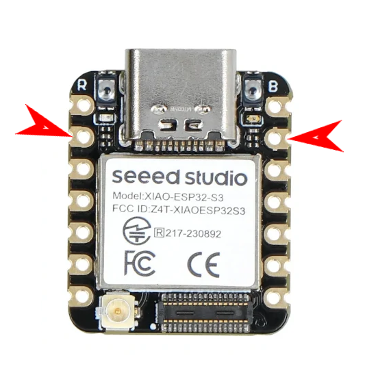

- Connect PIN **GPIO2** to **ground**.
- **Plug in** the power supply.
- Wait for **10 seconds**.
- After 10 seconds, the **FLASH LED will start flashing**.
- **Disconnect** PIN **GPIO2** from **ground** (but don't disconnect the power supply).
- After disconnecting **GPIO2** from **ground**, the **FLASH LED** will **stop flashing**, and the MCU will **automatically reboot**.
- Now the MCU is in the factory settings.

<a name="status_led"></a>
## Status LED

On the board, there is a status LED that provides a visual indicator of the module's current status
through blinking at defined intervals.

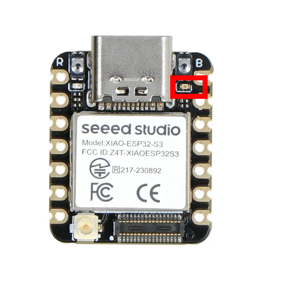

Upon module activation, the LED illuminates. After processor initialization, the LED exhibits different blinking intervals based on the current mode of the module

- **Service AP Mode only:** The LED blinks every **400 ms**, indicating the module's availability in service AP mode.
- **Connecting to WiFi AP:** While connecting to a WiFi Access Point, the LED blinks at intervals of **800 ms**.
- **Connected to WiFi Network:** Upon successful connection to a WiFi network, the LED blinks at intervals of **4000 ms**, signaling a stable connection.
- **Problematic State:** If an issue or error occurs, the LED accelerates its blinking to every **100 ms**.

The approximate boot time of the device is 15-20 seconds.

<a name="schematic"></a>
## Schematic for XIAO ESP32-S3 Sense

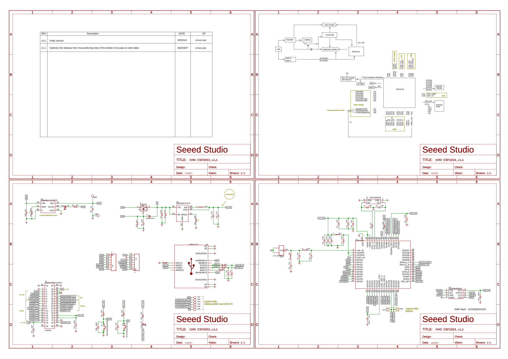

The scheme main board is available [here](XIAO_ESP32S3_ExpBoard_v1.0_SCH.pdf) in PDF format

The scheme extension board is available [here](XIAO_ESP32S3_SCH_v1.1.pdf) in PDF format

Pinout

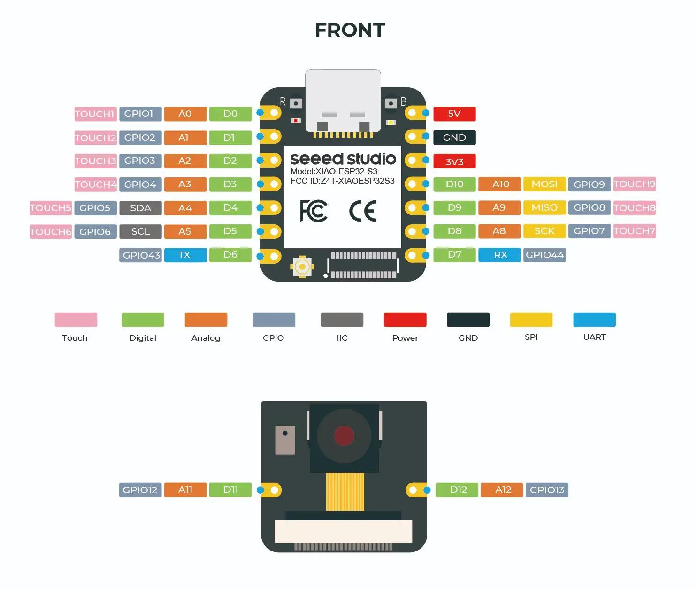

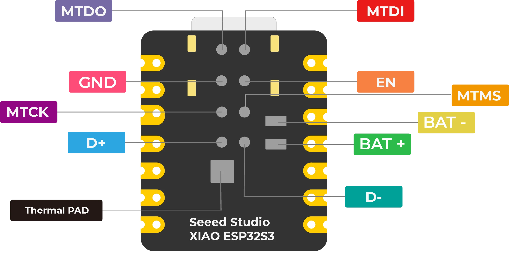

<a name="led_issue"></a>
## FLASH LED issue

This board version don't have **FLASH LED** on the board. Therefore, if a FLASH LED is needed, a GPIO 4 pin should be used to connect an external LED for FLASH. The FLASH LED can be connected, for example, as an LED strip using a relay. 


For the external LED is in the SW used **GPIO pin 4**.

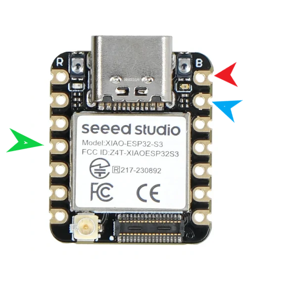

However, a 5mm LED can also be connected directly. **CAUTION**: The digital GPIO output from the XIAO ESP32-S3 board has a current limitation of a **maximum of 40mA**! Therefore, it is recommended to switch the LED using a **transistor** rather than directly through the GPIO pin. Improper use of the GPIO pin can lead to permanent damage.

<a name="power_supply"></a>
## Power Supply

The device requires a 5V power supply, with a maximum current consumption of 2A. Power is supplied via a micro USB connector when using the original programmer.

<a name="power_supply"></a>
## Power Supply

The device requires a 5V power supply, with a maximum current consumption of 2A. Power is supplied via a micro USB connector when using the original programmer.

<a name="ext_sens"></a>
## External temperature sensor DHT22/DHT11

Below you will find the wiring diagram for the DHT22 or DHT11 sensor.

| Camera board | DHT22/DHT11 |
|--------------|-------------|
| 3.3V         | VCC         |
| GND          | GND         |
| GPIO1        | Data        |

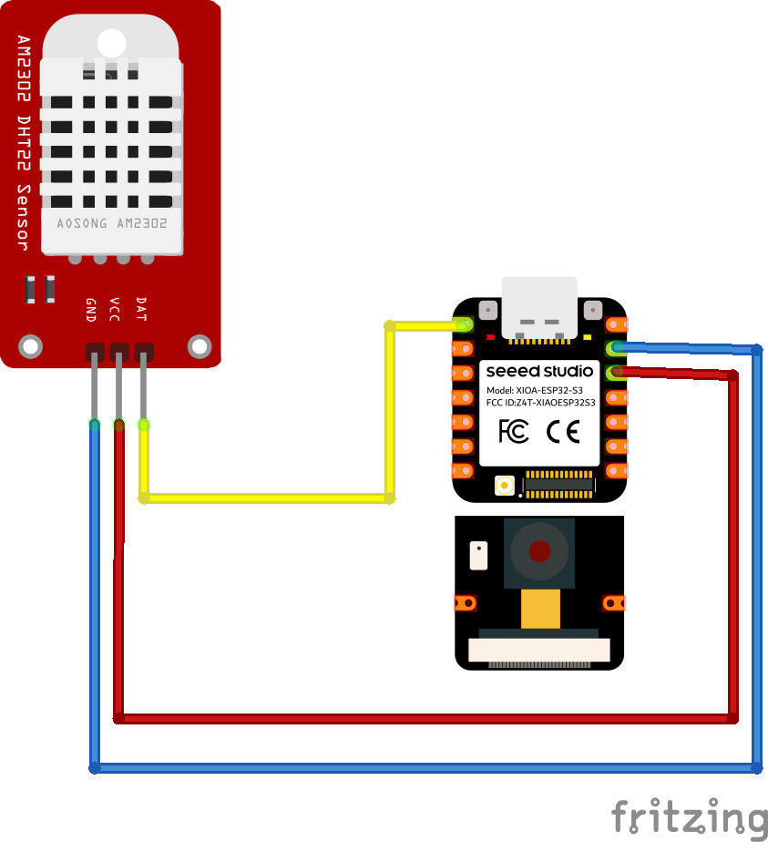

<a name="issue"></a>
## Potential issue with this board

- Overheating main board
- Slow WEB page loading during first 1 minutes after MCU start

